<!-- HU-STATUS TEMPLATE - do NOT remove the <!-- ... --> markers or the table headers.
     Your weekly grade is read AUTOMATICALLY from this file:
       01-week/hu-status/README.md  (inside YOUR fork). English. -->

# Weekly Status - Week 01

<!-- CONFIG-START - must match your profile repo (username/username) CONFIG -->
- FULL_NAME: Juan Diego Tovar Rodriguez
- GITHUB_USER: jdtovar07
- TEAM: The illusionists
- SPRINT_GOAL: Generation of firts documentacion(PDR) based in the intructions by the teacher
<!-- CONFIG-END -->

## 1. User stories worked this week
| HU ID | Title | Status (todo/doing/done) | Evidence (PR or commit URL) |
|---|---|---|---|
| HU-XXX-001 |  |  |  |

## 2. My individual contribution
-

# Week 1 Diagram

Covers both sessions: distributed systems theory + professional engineering foundations.

```mermaid
flowchart LR
    subgraph S1["📡 Session 1 — Theory"]
        direction TB
        NET["Network Boundary\n8 fallacies to never assume\nno shared state · no global clock\nno all-or-nothing failure"]
        NET --> FAIL["Failure Models\ncrash-stop\ncrash-recovery\nomission\nByzantine"]
        NET --> CLOCK["Logical Time\nLamport → order\nVector → causality"]
        NET --> SPEC["Consistency Spectrum\nLinearizable ←strong·slow→ Eventual\nCAP: Partition → C or A\nPACELC: Else → Latency vs C"]
        NET --> SEM["Delivery Semantics\nat-most-once · at-least-once\nexactly-once processing\n= at-least-once + idempotency"]
        SPEC --> QR["Quorums\nR + W > N"]
        SPEC --> CONS["Consensus\nRaft · FLP impossibility\nmajority ACK to commit"]
    end

    subgraph S2["🏗️ Session 2 — Practice"]
        direction TB
        DDD["DDD\nbounded context = microservice\naggregate = only mutation point\nvalue object · domain event"]
        HEX["Hexagonal Architecture\nCore knows no I/O\nPorts = interfaces\nAdapters = implementations\nadapters → app → domain"]
        PAT["Resilience Patterns\nCircuit Breaker · Retry+Jitter\nSaga+compensations · Outbox\nCQRS"]
        TDD["Testing Strategy\nunit · integration · contract · e2e\ncoverage floor · honest reporting"]
        WOW["Ways of Working\nScrum + ADRs + Git Flow\nhu-xxx-dev→develop\nhu-xxx-qa→qa\nhu-xxx-main→main"]
        DEL["Individual Deliverable\n01-week/hu-status/README.md\ngraded automatically"]
        DDD --> HEX --> PAT --> TDD --> WOW --> DEL
    end

    FAIL -- "design for it" --> PAT
    SPEC -- "choose per operation" --> DDD
    SEM -- "idempotency enforced in" --> PAT
    CLOCK -- "ordering needed in" --> CONS
```

## 3. Blockers and risks
-

## 4. Plan for next week
-

## 5. Compliance self-check
- [ ] Conventional Commits - `type(scope): summary`
- [ ] Per-environment HU branch + PR to that environment (hu-xxx-dev -> develop, ...)
- [ ] Testable acceptance criteria
- [ ] Tests added/updated (unit / integration)
- [ ] DDD / hexagonal boundaries respected (domain has no I/O)
- [ ] No secrets; config via environment variables

## 6. Evidence links
-
