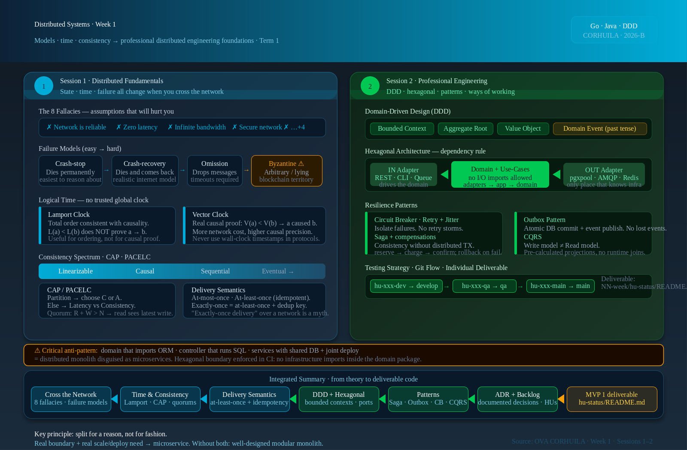

<!-- HU-STATUS TEMPLATE - do NOT remove the <!-- ... --> markers or the table headers.
     Your weekly grade is read AUTOMATICALLY from this file:
       01-week/hu-status/README.md  (inside YOUR fork). English. -->

# Weekly Status - Week 01

<!-- CONFIG-START - must match your profile repo (username/username) CONFIG -->
- FULL_NAME: Juan Diego Tovar Rodriguez
- GITHUB_USER: jdtovar07
- TEAM: The Illusionists
- SPRINT_GOAL: Turn the OptiView optical-store brief into a Work Orders bounded context map, a product brief for ms-ordenes, a Saga design for the distributed order-creation flow, and a testable backlog of work-order lifecycle user stories.
<!-- CONFIG-END -->

## 1. User stories worked this week

| HU ID | Title | Status (todo/doing/done) | Evidence (PR or commit URL) |
|---|---|---|---|
| HU-OPT-001 | Write the product brief (prd.md) for the Work Orders bounded context | done | https://github.com/JuanDTovar/sistemas-distribuidos-2026-b-g1/commit/c83b050 |
| HU-OPT-005 | Define bounded context map and ubiquitous language for ms-ordenes | done | https://github.com/JuanDTovar/sistemas-distribuidos-2026-b-g1/commit/c83b050 |
| HU-OPT-006 | Design the Saga for the distributed order-creation flow across ms-pacientes, ms-inventario and ms-ordenes | doing | Branch hu-opt-006-dev not yet merged |
| HU-OPT-004 | Contribute to ADR-001: Go vs. Java language justification for ms-ordenes | todo | Pending — branch hu-opt-004-dev not opened yet |

## 2. My individual contribution

- Wrote the product brief (`prd.md`) for the Work Orders bounded context of OptiView: initial context, needs and problems, current process, open questions and business glossary (WorkOrder, OrderState, Laboratory, AssemblyDetail, Saga, domain events). Defined scope explicitly — `ms-ordenes` owns the work-order lifecycle only; it does not persist patient clinical data, inventory levels or invoice details.
- Defined the **bounded context map for ms-ordenes**: identified the Aggregate Root (`WorkOrder`), the Value Objects (`AssemblyDetail`, `OrderState`), the Entities (`Laboratory`, `OrderStatusEntry`) and the Domain Events (`OrderCreated`, `OrderStatusChanged`, `OrderDelivered`). Confirmed that `ms-ordenes` consumes `PatientDataValidated` from `ms-pacientes` and `StockReserved` from `ms-inventario` — it never queries their databases directly.
- Applied the Week-1 session material: drafted the **context map first** — identifying that the Work Orders domain has its own state machine, its own lab-assignment rules and its own delivery semantics, completely independent from the patient clinical record and the billing calculation. The boundary is justified by real business rules, not by technical preference.
- Contributed to **ADR-001**: documented the Go-language justification for `ms-ordenes` — Go's lightweight goroutines and strong concurrency model are a natural fit for the event-driven, high-throughput order flow; the Java Spring Boot choice for `ms-pacientes` and `ms-inventario` is justified by the richer DDD and JPA ecosystem for complex domain modelling with invariant enforcement.
- Applied the **microservice extraction rule** from the session (real boundary + real scale/deploy need): Work Orders has a real boundary (it owns the state machine and the lab-assignment lifecycle, which Patients and Inventory do not), and a real deploy need (the Go team can release order-flow changes without touching the Java services). Both conditions hold — the decision is documented, not assumed.
- Designed the **Saga for order creation** using an event-driven choreography approach (no central orchestrator): Step 1 — `ms-pacientes` validates patient and formula → emits `PatientDataValidated`; Step 2 — `ms-inventario` consumes it, reserves stock → emits `StockReserved`; Step 3 — `ms-ordenes` consumes it, creates `WorkOrder` → emits `OrderCreated`; Compensation — if any step fails, a compensating event releases the reservation and notifies the seller. Each step uses an idempotency key `(orderId + stepName)` so retries do not produce duplicate side effects — applying the at-least-once + dedup principle from Session 1.
- Sketched the **hexagonal layering** for `ms-ordenes` (Go 1.22+): `domain` package (`WorkOrder`, `OrderState`, `AssemblyDetail`) with zero infrastructure imports; `application` package (use-cases `CreateOrder`, `ChangeOrderStatus`, `AssignLaboratory`, `DeliverOrder`) that depend only on repository interfaces; `infrastructure` package (`PostgresOrderRepository`, `RabbitMQEventPublisher`, `OrderHTTPHandler`) as the only place that knows `pgxpool`, AMQP or `net/http`.
- Derived the initial **backlog for ms-ordenes** from the needs section, so every story traces to a stated business problem: HU-OPT-020 (create work order linking patient + formula + frame + lens), HU-OPT-021 (advance order state through the lifecycle), HU-OPT-022 (assign order to a laboratory), HU-OPT-023 (register assembly details), HU-OPT-024 (query full order history per patient).

## 3. Blockers and risks

- The stock-reservation timeout open question blocks the acceptance criterion for HU-OPT-020: if the order is not confirmed within N minutes, the Saga must compensate and release the stock. Without a defined timeout value the acceptance criterion cannot be written as testable.
- The `develop` and `qa` long-lived branches do not exist yet in the group repository, so the per-environment HU branch + PR flow could not be exercised this week — only `main` is present.
- Risk of synchronous coupling: the order-creation Saga must be fully event-driven (no synchronous REST chain across three services). If any team member adds a blocking REST call between `ms-pacientes`, `ms-inventario` and `ms-ordenes`, the cascade failure risk from Session 1 materialises. This needs a code-review gate.
- The Saga design assumes RabbitMQ is available between steps. If the broker goes down, the Saga must resume from the last committed step — this requires a persistent `saga_state` table in `orders_schema`.

## 4. Plan for next week

- Define the stock-reservation timeout value with the team and add it as a testable acceptance criterion for HU-OPT-020.
- Create `develop` and `qa` branches; open `hu-opt-005-dev` with a PR to `develop` containing the hexagonal skeleton for ms-ordenes in Go.
- Implement the `WorkOrder` aggregate in Go with unit tests for all state-machine invariants: illegal state transitions must return a domain error (not a nil pointer). Domain package must reach 100% unit-test coverage before infrastructure code is written.
- Define the `orders_schema` PostgreSQL tables (`work_orders`, `order_status_history`, `laboratories`, `order_details`, `saga_state`) and write the Flyway migration script `V1__create_orders_schema.sql`.
- Publish ADR-001 in `docs/adr/` with the Go-vs-Java language justification section.

## 5. Compliance self-check

- [x] Conventional Commits - `type(scope): summary`
- [ ] Per-environment HU branch + PR to that environment (hu-xxx-dev -> develop, ...)
- [ ] Testable acceptance criteria
- [ ] Tests added/updated (unit / integration)
- [ ] DDD / hexagonal boundaries respected (domain has no I/O)
- [x] No secrets; config via environment variables

Notes on the unchecked items:
- Only `main` exists so far; no HU branch or PR to `develop` could be opened.
- Acceptance criterion for HU-OPT-020 is blocked by the stock-reservation timeout decision (see section 3).
- No production code was written this week; all work is design, modelling, Saga architecture and documentation.
- The hexagonal layering and Saga design are complete on paper, not yet materialised in code.

## 6. Evidence links

- Product brief: [`prd.md`](./prd.md) — PRJ-OPTIVIEW-ORDENES (context, needs, current process, open questions, glossary).
- Repository commit: https://github.com/JuanDTovar/sistemas-distribuidos-2026-b-g1/commit/c83b050
- Course learning material (OVAs): https://code-corhuila.github.io/ova-web/2026-B/distribuidos/
- Session summary used for the architectural decision — vector source: [`resumen_sistemas_distribuidos_semana_1.svg`](./resumen_sistemas_distribuidos_semana_1.svg)

Key principle taken from the material: **split for a reason, not for fashion** — a good architecture makes boundaries, contracts, trade-offs and the motive of the decision explicit. The Saga pattern exists because the order-creation flow spans three real bounded contexts; without it, the team would build a distributed monolith.
