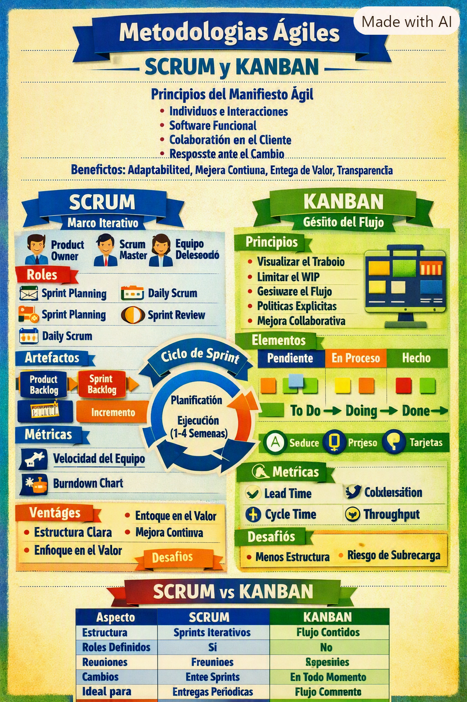
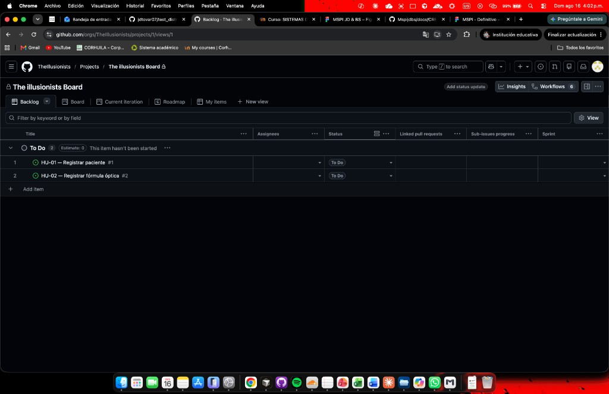
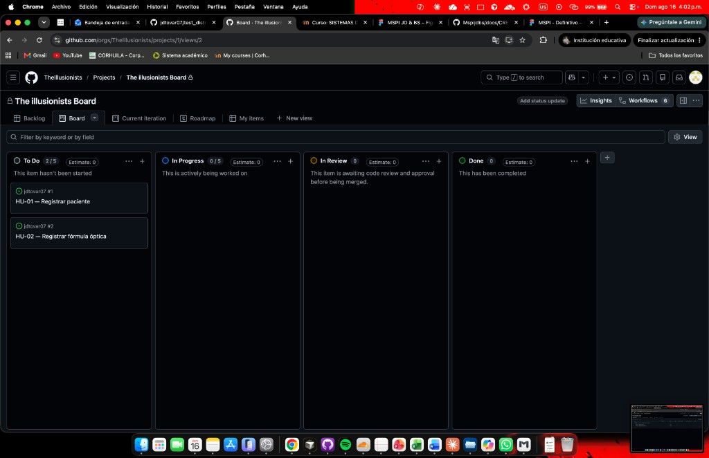

<!-- HU-STATUS TEMPLATE - do NOT remove the <!-- ... --> markers or the table headers.
     Your weekly grade is read AUTOMATICALLY from this file:
       02-week/hu-status/README.md  (inside YOUR fork). English. -->

# Weekly Status - Week 02

<!-- CONFIG-START - must match your profile repo (username/username) CONFIG -->
- FULL_NAME: Juan Diego Tovar Rodriguez
- GITHUB_USER: jdtovar07
- TEAM: The Illusionists
- SPRINT_GOAL: Document Scrum and Kanban, practise Git Flow in a sandbox, and start the OptiView product backlog on The Illusionists GitHub board with testable user stories (HU-01, HU-02).
<!-- CONFIG-END -->

## 1. User stories worked this week

| HU ID | Title | Status (todo/doing/done) | Evidence (PR or commit URL) |
|---|---|---|---|
| HU-OPT-010 | Document Scrum and Kanban ways of working for The Illusionists | done | [`Scrum-Kanbam-JD.md`](./Scrum-Kanbam-JD.md) |
| HU-OPT-011 | Produce a visual summary (infographic) of Scrum vs Kanban | done | [`Scrum&Kanbam.png`](./Scrum&Kanbam.png) |
| HU-OPT-012 | Practise Git Flow in a sandbox repo (feature → dev via PR) | done | https://github.com/jdtovar07/test_distributed_systems/pull/1 |
| HU-OPT-013 | Document the Git Flow practice and map it to the course workflow | done | [`git-flow.md`](./git-flow.md) |
| HU-OPT-014 | Document the full environment flow (dev → qa → main + hotfix) on `dev` | done | https://github.com/jdtovar07/test_distributed_systems/pull/2 |
| HU-OPT-015 | Promote `dev` → `qa` in the sandbox (environment PR) | done | https://github.com/jdtovar07/test_distributed_systems/pull/4 |
| HU-OPT-016 | Promote `qa` → `main` in the sandbox (production PR) | done | https://github.com/jdtovar07/test_distributed_systems/pull/5 |
| HU-OPT-017 | Practise hotfix flow (`hotfix/*` → `main`) in the sandbox | done | https://github.com/jdtovar07/test_distributed_systems/pull/6 |
| HU-OPT-018 | Back-propagate hotfix `main` → `qa` | done | https://github.com/jdtovar07/test_distributed_systems/pull/7 |
| HU-OPT-019 | Back-propagate hotfix `main` → `dev` | done | https://github.com/jdtovar07/test_distributed_systems/pull/8 |
| HU-OPT-030 | Produce a visual summary of the Git Flow practised in the sandbox | done | [`GitFlow.png`](./GitFlow.png) |
| HU-OPT-031 | Create HU-01 (Registrar paciente) on the team board | done | https://github.com/jdtovar07/jdtovar07/issues/1 |
| HU-OPT-032 | Create HU-02 (Registrar fórmula óptica) on the team board | done | https://github.com/jdtovar07/jdtovar07/issues/2 |
| HU-OPT-033 | Document the Illusionists backlog / Kanban board evidence | done | [`board-backlog.md`](./board-backlog.md) |
| HU-OPT-034 | Practise classic release close (`release/*` → `main`) | done | https://github.com/jdtovar07/test_distributed_systems/pull/9 |

## 2. My individual contribution

- Wrote the Agile ways-of-working brief (`Scrum-Kanbam-JD.md`): Agile Manifesto principles, Scrum (roles, events, artefacts, Sprint cycle, velocity / burndown) and Kanban (WIP limits, board, lead time / cycle time / throughput).
- Produced a comparison table Scrum vs Kanban (structure, roles, meetings, change policy, ideal use) and a short recommendation for teaching / applying both in a software team.
- Created the visual summary [`Scrum&Kanbam.png`](./Scrum&Kanbam.png) as session evidence for Week 02.
- Tied the material to OptiView / The Illusionists: Scrum for Sprint-based delivery of `ms-ordenes` user stories; Kanban principles (visualise work, limit WIP) for day-to-day flow on the board.
- Set up the sandbox repo [`jdtovar07/test_distributed_systems`](https://github.com/jdtovar07/test_distributed_systems) with long-lived branches `main`, `dev` and `qa`.
- Executed the first Git Flow step: branched `feature/documentar-feature-flow` from `dev`, documented the feature flow in the sandbox README with Conventional Commits, opened and **merged PR #1** into `dev`.
- Executed the second step: branched `docs/documentar-flujo-ambientes`, documented the full `dev` → `qa` → `main` promotions and hotfix flow, opened and **merged PR #2** into `dev`.
- Executed the first real environment promotion: opened and **merged PR #4** (`dev` → `qa`). Closed PR #3 without merge after targeting `main` by mistake.
- Completed the chain to production: opened and **merged PR #5** (`qa` → `main`) — Feature → `dev` → `qa` → `main` is now fully practised in the sandbox.
- Practised the hotfix path: branched `hotfix/documentar-hotfix` from `main`, documented hotfix propagation, opened and **merged PR #6** into `main`.
- Back-propagated the hotfix into QA: opened and **merged PR #7** (`main` → `qa`).
- Finished the hotfix loop into development: opened and **merged PR #8** (`main` → `dev`) — `main`, `qa` and `dev` are aligned again.
- Practised classic Git Flow release close: branched `release/1.0.0`, documented the release flow, opened and **merged PR #9** into `main`.
- Created the Git Flow visual summary [`GitFlow.png`](./GitFlow.png): Master / Develop / Feature / Release / Hotfix with tags (`v1.0.0`, `v1.0.1`).
- Wrote [`git-flow.md`](./git-flow.md) as the Week-02 deliverable: records PR #1–#2 and #4–#9 evidence and maps `dev` → course `develop`.
- Created the first OptiView backlog items as GitHub Issues with testable acceptance criteria: [HU-01 — Registrar paciente](https://github.com/jdtovar07/jdtovar07/issues/1) (3 SP) and [HU-02 — Registrar fórmula óptica](https://github.com/jdtovar07/jdtovar07/issues/2) (5 SP), labelled for `ms-pacientes` / Fase 1.
- Placed both stories on [The illusionists Board](https://github.com/orgs/TheIllusionists/projects/1) in **To Do** (visible in Backlog and Kanban views); documented evidence in [`board-backlog.md`](./board-backlog.md) with screenshots.

## 3. Blockers and risks

- Week-01 open items still open in the **group** repo: stock-reservation timeout for HU-OPT-020; the full per-environment HU + PR flow is proven in the sandbox but not yet applied to the OptiView / group repository.
- Sandbox uses branch name `dev` instead of course name `develop` — documented as an alias in [`git-flow.md`](./git-flow.md); risk of confusion if teammates copy the short name into the group repo.
- First board HUs are for `ms-pacientes`; `ms-ordenes` stories are not on the board yet.

## 4. Plan for next week

- Apply the same Git Flow in the group / OptiView repo (`develop`, `qa`, `main` + `hu-opt-xxx-*` branches).
- Add `ms-ordenes` HUs to The Illusionists Board with testable acceptance criteria.
- Resolve with the team the stock-reservation timeout (blocks HU-OPT-020 acceptance criteria).

## 5. Compliance self-check

- [x] Conventional Commits - `type(scope): summary`
- [x] Per-environment HU branch + PR to that environment (hu-xxx-dev -> develop, ...)
- [x] Testable acceptance criteria
- [ ] Tests added/updated (unit / integration)
- [ ] DDD / hexagonal boundaries respected (domain has no I/O)
- [x] No secrets; config via environment variables

Notes on the unchecked items:
- Conventional Commits were used on the sandbox PRs (`docs(...)`, `chore(...)`, `fix(hotfix): ...`, `fix(qa): ...`, `fix(dev): ...`, `docs(release): ...`).
- Full sandbox flow: Feature → `dev` → `qa` → `main` + hotfix loop + release close (PRs #1–#2, #4–#9).
- Testable acceptance criteria: written on [HU-01](https://github.com/jdtovar07/jdtovar07/issues/1) and [HU-02](https://github.com/jdtovar07/jdtovar07/issues/2); implementation/tests still pending.
- No production code / domain tests this week yet — focus is Agile WoW + Git Flow + backlog on the board.

## 6. Evidence links

- Scrum & Kanban brief: [`Scrum-Kanbam-JD.md`](./Scrum-Kanbam-JD.md)
- Infographic: [`Scrum&Kanbam.png`](./Scrum&Kanbam.png)
- Git Flow practice write-up: [`git-flow.md`](./git-flow.md)
- Git Flow infographic: [`GitFlow.png`](./GitFlow.png)
- Board / backlog write-up: [`board-backlog.md`](./board-backlog.md)
- The Illusionists Board: https://github.com/orgs/TheIllusionists/projects/1
- HU-01 — Registrar paciente: https://github.com/jdtovar07/jdtovar07/issues/1
- HU-02 — Registrar fórmula óptica: https://github.com/jdtovar07/jdtovar07/issues/2
- Sandbox repo: https://github.com/jdtovar07/test_distributed_systems
- PR #1 — feature → `dev` (merged): https://github.com/jdtovar07/test_distributed_systems/pull/1
- PR #2 — document `dev` → `qa` → `main` + hotfix on `dev` (merged): https://github.com/jdtovar07/test_distributed_systems/pull/2
- PR #4 — promote `dev` → `qa` (merged): https://github.com/jdtovar07/test_distributed_systems/pull/4
- PR #5 — promote `qa` → `main` (merged): https://github.com/jdtovar07/test_distributed_systems/pull/5
- PR #6 — hotfix → `main` (merged): https://github.com/jdtovar07/test_distributed_systems/pull/6
- PR #7 — sync hotfix `main` → `qa` (merged): https://github.com/jdtovar07/test_distributed_systems/pull/7
- PR #8 — sync hotfix `main` → `dev` (merged): https://github.com/jdtovar07/test_distributed_systems/pull/8
- PR #9 — release/`1.0.0` → `main` (merged): https://github.com/jdtovar07/test_distributed_systems/pull/9

