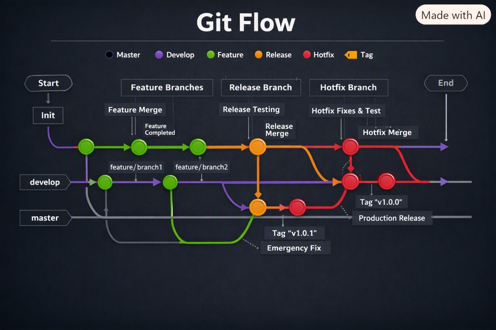

# Git Flow — practice deliverable (Week 02)

Test repository used to exercise the per-environment Git Flow required by the course:

- **Repo:** https://github.com/jdtovar07/test_distributed_systems
- **Owner:** `jdtovar07`

## Long-lived branches in the test repo

| Branch | Role |
|---|---|
| `main` | Production — stable / release only |
| `dev` | Continuous integration (course equivalent: `develop`) |
| `qa` | QA / staging — validate what comes from `dev` before production |

> Note: this practice repo uses the short name `dev`. In the course / OptiView workflow the equivalent long-lived branch is named `develop`.

## Course mapping (OptiView / group repo)

```
develop  <-  hu-xxx-dev   (PR to develop)
qa       <-  hu-xxx-qa    (PR to qa)
main     <-  hu-xxx-main  (PR to main)
```

Conventional Commits: `type(scope): summary`.

---

## Step 1 — Feature → `dev` (PR #1)

### Flow executed

1. Created long-lived base branches (`main`, `dev`, `qa`).
2. Branched `feature/documentar-feature-flow` from `dev`.
3. Documented the base branches and the feature flow in `README.md` (Conventional Commits).
4. Opened **PR #1** against `dev` and merged it.

### Evidence — Pull Request #1

| Field | Value |
|---|---|
| Title | Feature/documentar feature flow |
| URL | https://github.com/jdtovar07/test_distributed_systems/pull/1 |
| Head | `feature/documentar-feature-flow` |
| Base | `dev` |
| State | **merged** |
| Merge commit | `03b03b3` |

### Commits on the PR

| SHA | Message |
|---|---|
| `9bcc537` | `docs(develop): document base main and develop branches` |
| `ef59bf3` | `docs(feature): document feature branch flow in README` |

---

## Step 2 — Document environment flow on `dev` (PR #2)

### Flow executed

1. Branched `docs/documentar-flujo-ambientes` from `dev`.
2. Extended the sandbox README to describe the full chain: Feature → `dev` → `qa` → `main`, plus hotfix from `main`.
3. Opened **PR #2** against `dev` and merged it.

### Evidence — Pull Request #2

| Field | Value |
|---|---|
| Title | docs(qa): document dev qa and main branch flow |
| URL | https://github.com/jdtovar07/test_distributed_systems/pull/2 |
| Head | `docs/documentar-flujo-ambientes` |
| Base | `dev` |
| State | **merged** |
| Merge commit | `1900a03` |

### Commits on the PR

| SHA | Message |
|---|---|
| `3a3c73b` | `docs(qa): document dev qa and main branch flow` |

### What landed on `dev` (after PR #2)

The `dev` README now describes:

- `main` — production
- `dev` — development / integration
- `qa` — quality assurance / staging
- Feature flow (`feature/*` → `dev` via PR) — exemplified by PR #1
- Promotion `dev` → `qa` via PR
- Promotion `qa` → `main` via PR
- Hotfix (`hotfix/*` from `main`, then back-propagate to `qa` and `dev`)

---

## Step 3 — Promote `dev` → `qa` (PR #4)

### Flow executed

1. Opened a promotion PR with head `dev` and base `qa`.
2. Merged **PR #4**, bringing the documented feature + environment-flow content from `dev` into `qa`.

> Note: PR #3 (`dev` → `main`) was opened by mistake and **closed without merge**. The correct next hop is `dev` → `qa` (PR #4), then later `qa` → `main`.

### Evidence — Pull Request #4

| Field | Value |
|---|---|
| Title | chore(qa): promote dev changes to qa |
| URL | https://github.com/jdtovar07/test_distributed_systems/pull/4 |
| Head | `dev` |
| Base | `qa` |
| State | **merged** |
| Merge commit | `5a6dce9` |

### What this proves

`qa` now receives the same README / Git Flow documentation that was integrated on `dev` via PR #1 and PR #2 — the first real environment promotion in the sandbox.

---

## Step 4 — Promote `qa` → `main` (PR #5)

### Flow executed

1. Opened a promotion PR with head `qa` and base `main`.
2. Merged **PR #5**, bringing the validated QA content into production (`main`).

### Evidence — Pull Request #5

| Field | Value |
|---|---|
| Title | chore(main): promote qa changes to production |
| URL | https://github.com/jdtovar07/test_distributed_systems/pull/5 |
| Head | `qa` |
| Base | `main` |
| State | **merged** |
| Merge commit | `4ecf72d` |

### Full chain completed in the sandbox

```
feature/*  --PR#1-->  dev  --PR#4-->  qa  --PR#5-->  main
                 ^                                    ^
                 +-- PR#2 (docs of the environment flow)
                                                      |
                              hotfix/* ----PR#6--------+---- release/1.0.0 --PR#9--+
                                                      |                           |
                              PR#7 (main → qa) <------+----> PR#8 (main → dev)
```

---

## Step 5 — Hotfix → `main` (PR #6)

### Flow executed

1. Branched `hotfix/documentar-hotfix` from `main` (production incident path).
2. Documented the hotfix propagation sequence in the sandbox README.
3. Opened and **merged PR #6** into `main`.

### Evidence — Pull Request #6

| Field | Value |
|---|---|
| Title | fix(hotfix): document hotfix propagation in README |
| URL | https://github.com/jdtovar07/test_distributed_systems/pull/6 |
| Head | `hotfix/documentar-hotfix` |
| Base | `main` |
| State | **merged** |
| Merge commit | `9a60c0f` |

### Commits on the PR

| SHA | Message |
|---|---|
| `084a025` | `fix(hotfix): document hotfix propagation in README` |

### Hotfix propagation (documented in README)

1. PR hotfix → `main` (**done** — PR #6)
2. PR `main` → `qa` (**done** — PR #7)
3. PR `main` → `dev` (**done** — PR #8)

---

## Step 6 — Sync hotfix `main` → `qa` (PR #7)

### Flow executed

1. Opened a back-propagation PR with head `main` and base `qa`.
2. Merged **PR #7**, bringing the hotfix documentation from production into QA.

### Evidence — Pull Request #7

| Field | Value |
|---|---|
| Title | fix(qa): sync hotfix from main into qa |
| URL | https://github.com/jdtovar07/test_distributed_systems/pull/7 |
| Head | `main` |
| Base | `qa` |
| State | **merged** |
| Merge commit | `201d0c9` |

---

## Step 7 — Sync hotfix `main` → `dev` (PR #8)

### Flow executed

1. Opened a back-propagation PR with head `main` and base `dev`.
2. Merged **PR #8**, bringing the hotfix documentation from production into `dev`.

### Evidence — Pull Request #8

| Field | Value |
|---|---|
| Title | fix(dev): sync hotfix from main into dev |
| URL | https://github.com/jdtovar07/test_distributed_systems/pull/8 |
| Head | `main` |
| Base | `dev` |
| State | **merged** |
| Merge commit | `e53baff` |

---

## Step 8 — Release branch → `main` (PR #9)

### Flow executed

1. Branched `release/1.0.0` (classic Git Flow release close).
2. Documented and adapted the release flow for `dev` / `qa` / `main` in the sandbox README.
3. Opened and **merged PR #9** into `main`.

### Evidence — Pull Request #9

| Field | Value |
|---|---|
| Title | docs(release): align release close with classic git flow |
| URL | https://github.com/jdtovar07/test_distributed_systems/pull/9 |
| Head | `release/1.0.0` |
| Base | `main` |
| State | **merged** |
| Merge commit | `693a8c4` |

### Commits on the PR

| SHA | Message |
|---|---|
| `350b7a6` | `docs(release): document release branch flow in README` |
| `d938a7f` | `docs(release): adapt release flow to dev qa and main` |

---

## Visual summary



Infographic of the classic Git Flow practised in the sandbox: Master, Develop, Feature branches, Release (`v1.0.0`) and Hotfix (`v1.0.1`).

---

## Status

Practised in [`test_distributed_systems`](https://github.com/jdtovar07/test_distributed_systems):

- Feature → `dev` → `qa` → `main`
- Hotfix → `main` (PR #6) → sync to `qa` (PR #7) → sync to `dev` (PR #8) — **full hotfix loop complete**
- Release → `main` (PR #9) — classic Git Flow release close (`release/1.0.0`)
- Visual evidence: [`GitFlow.png`](./GitFlow.png)

Optional: align the practice branch name with the course (`develop`) or keep `dev` as the documented alias.

## Why this matters for OptiView

The Week-01 blocker (“only `main` exists; no HU branch + PR to `develop`”) is unblocked in the sandbox. The same PR-per-environment model — plus hotfix and release close — now applies to `ms-ordenes` stories (`hu-opt-xxx-dev` / `-qa` / `-main`).
