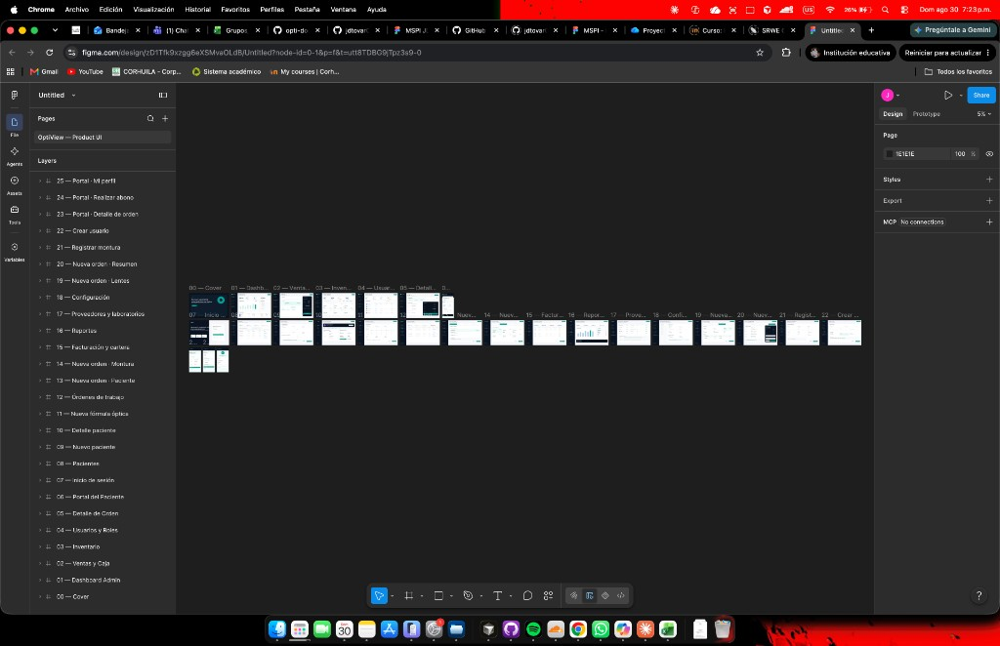

<!-- PLANTILLA HU-STATUS (traducción al español) - NO borres los marcadores <!-- ... -->
     ni las cabeceras de tabla.
     ATENCIÓN: la nota semanal se lee AUTOMÁTICAMENTE del archivo en inglés:
       04-week/hu-status/README.md  (dentro de TU fork).
     Este archivo es una copia en español para lectura y no se califica. -->

# Estado Semanal - Semana 04

<!-- CONFIG-START - debe coincidir con el CONFIG de tu repo de perfil (username/username) -->
- FULL_NAME: Juan Diego Tovar Rodriguez
- GITHUB_USER: jdtovar07
- TEAM: The Illusionists
- SPRINT_GOAL: Construir la UI completa de producto OptiView en Figma — 25 vistas de alta fidelidad que cubren flujos de administración, ventas y portal del paciente — en colaboración con Bairon Suarez, y documentar cada pantalla con su propósito, componentes y mapa de navegación.
<!-- CONFIG-END -->

## 1. Historias de usuario trabajadas esta semana

| HU ID | Título | Estado (todo/doing/done) | Evidencia (URL de PR o commit) |
|---|---|---|---|
| HU-OPT-040 | Diseñar dashboard admin y vistas core de operaciones (01–05) | done | [`figma-ui-flow.md`](./figma-ui-flow.md) |
| HU-OPT-041 | Diseñar módulo de pacientes (08–11) | done | [`figma-ui-flow.md`](./figma-ui-flow.md) |
| HU-OPT-042 | Diseñar listado de órdenes y wizard de nueva orden (12–14, 19–20) | done | [`figma-ui-flow.md`](./figma-ui-flow.md) |
| HU-OPT-043 | Diseñar facturación, reportes, proveedores y configuración (15–18) | done | [`figma-ui-flow.md`](./figma-ui-flow.md) |
| HU-OPT-044 | Diseñar formularios de inventario y gestión de usuarios (21–22) | done | [`figma-ui-flow.md`](./figma-ui-flow.md) |
| HU-OPT-045 | Diseñar vistas del portal del paciente (06–07, 23–25) | done | [`figma-ui-flow.md`](./figma-ui-flow.md) |
| HU-OPT-046 | Documentar flujo UI completo en Figma con mapa de navegación y convenciones de diseño | done | [`figma-ui-flow.md`](./figma-ui-flow.md) |

## 2. Mi contribución individual

- Construí el archivo Figma completo **OptiView Product UI** en colaboración con **Bairon Suarez** — 25 vistas de aplicación (frames `01`–`25`) en la página **OptiView - Product UI**, más una portada de presentación (`00`).
- **Archivo Figma:** https://www.figma.com/design/zD1Tfk9xzgg6eXSMvaOLdB/Untitled?node-id=0-1&t=VyPMTbmxBNHalmpI-1
- Definí un **design system** compartido para todas las vistas: layout desktop admin/ventas (sidebar izquierdo + barra superior + área de contenido blanca), portal del paciente mobile-first, paleta sidebar teal/oscuro, patrones de tablas y formularios, etiquetas en español y badges de estado de orden con código de colores.
- Diseñé **vistas admin y operaciones (01–05, 08–12, 15–18, 21–22):**
  - `01` Dashboard Admin — tarjetas KPI, gráficas, órdenes recientes
  - `02` Ventas y Caja — POS / caja para `VENDEDOR`
  - `03` Inventario — tabla de stock con alertas de stock bajo (`ms-inventario`)
  - `04` Usuarios y Roles — gestión RBAC alineada con `security-policy-opti.md`
  - `05` Detalle de Orden — vista completa del ciclo de vida de la OT (`ms-ordenes`, HU-09)
  - `08` Pacientes — registro buscable (HU-01)
  - `09` Nuevo paciente — formulario de registro (HU-01)
  - `10` Detalle paciente — perfil con historial de fórmulas (HU-03, HU-04)
  - `11` Nueva fórmula óptica — captura de prescripción (HU-02)
  - `12` Órdenes de trabajo — listado con filtros de estado (HU-08)
  - `15` Facturación y cartera — facturas y pagos (HU-10, HU-11, HU-12)
  - `16` Reportes — analítica y exportación
  - `17` Proveedores y laboratorios — registro de proveedores y laboratorios
  - `18` Configuración — ajustes de tienda y sistema
  - `21` Registrar montura — agregar montura al inventario (HU-05)
  - `22` Crear usuario — creación de cuenta de personal (Keycloak)
- Diseñé el **wizard de nueva orden (13–14, 19–20)** — flujo de 4 pasos para HU-08:
  - Paso 1 `13` Paciente — seleccionar paciente y fórmula activa (`ms-pacientes`)
  - Paso 2 `14` Montura — elegir montura del stock (`ms-inventario`)
  - Paso 3 `19` Lentes — configurar opciones de lentes desde la fórmula
  - Paso 4 `20` Resumen — revisar y confirmar, disparando la Saga distribuida
- Diseñé **vistas del portal del paciente (06–07, 23–25)** con Bairon Suarez — layouts orientados a móvil:
  - `06` Portal del Paciente — inicio con orden activa y recordatorios
  - `07` Inicio de sesión — login Keycloak (mockup de teléfono para app paciente)
  - `23` Portal — Detalle de orden — seguimiento de orden (solo lectura)
  - `24` Portal — Realizar abono — pago parcial/total (HU-11)
  - `25` Portal — Mi perfil — datos de contacto y preferencias de notificación
- Escribí [`figma-ui-flow.md`](./figma-ui-flow.md) documentando cada vista: nombre del frame, app destino, actor/rol, propósito, componentes UI clave, HU del backlog y microservicio relacionado, más mapa de navegación y reparto de colaboración.
- Captura de evidencia del Figma: [`OptiView-Product-UI.png`](./OptiView-Product-UI.png).

## 3. Bloqueadores y riesgos

- Las vistas Figma son mockups de alta fidelidad solamente — aún no hay implementación Angular/React; riesgo de deriva UI–API si no se escriben contratos OpenAPI antes de codificar.
- Las vistas del portal del paciente (06–07, 23–25) usan layouts móviles; breakpoints responsive para tablet/desktop aún no definidos.
- Timeout de reserva de stock (HU-OPT-020) sigue sin definir — la vista de resumen del wizard (`20`) no puede mostrar countdown/compensación sin ese valor.
- Reglas de visibilidad RBAC por vista (qué ítems del sidebar ve cada rol) están implícitas en el diseño pero aún no documentadas como matriz de permisos en `opti-docs/12-ux-ui/`.

## 4. Plan para la próxima semana

- Mapear cada vista Figma a endpoints OpenAPI y publicar contratos en `opti-docs/07-api/contracts/openapi/`.
- Iniciar implementación Angular del shell de `portal-admin` (sidebar + router) desde las vistas 01 y 08.
- Modelar la capa táctica DDD de `ms-ordenes` (agregado `WorkOrder`, máquina de estados, eventos de dominio).
- Actualizar `opti-docs/12-ux-ui/navigation-map.md` con el mapa de navegación de [`figma-ui-flow.md`](./figma-ui-flow.md).
- Resolver timeout de reserva de stock con el equipo para criterios de aceptación de HU-OPT-020.

## 5. Autoverificación de cumplimiento

- [x] Conventional Commits - `type(scope): summary`
- [ ] Rama HU por ambiente + PR a ese ambiente (hu-xxx-dev -> develop, ...)
- [x] Criterios de aceptación verificables
- [ ] Tests agregados/actualizados (unit / integration)
- [ ] Límites DDD / hexagonal respetados (dominio sin I/O)
- [x] Sin secretos; config vía variables de entorno

Notas sobre los ítems no marcados:
- Cada vista Figma mapea a una HU del backlog con criterios de aceptación UI verificables (campos de formulario, rutas de navegación, visibilidad por rol) documentados en [`figma-ui-flow.md`](./figma-ui-flow.md).
- No hubo código de producción esta semana — entregable es la UI Figma completa + documentación.
- Código DDD/dominio planificado para Semana 05 después de congelar contratos UI.

## 6. Enlaces de evidencia

- Archivo Figma (OptiView - Product UI): https://www.figma.com/design/zD1Tfk9xzgg6eXSMvaOLdB/Untitled?node-id=0-1&t=VyPMTbmxBNHalmpI-1
- Documentación del flujo UI: [`figma-ui-flow.md`](./figma-ui-flow.md)
- Captura Figma (25 vistas): [`OptiView-Product-UI.png`](./OptiView-Product-UI.png)
- Brief de producto / PRD: [`01-week/hu-status/prd.md`](../../01-week/hu-status/prd.md)
- Gobernanza Semana 03 (roles RBAC por vista): [`opti-docs/security-policy-opti.md`](https://github.com/jdtovar07/opti-docs/blob/main/00-governance/security-policy-opti.md)
- Tablero The Illusionists: https://github.com/orgs/TheIllusionists/projects/1

