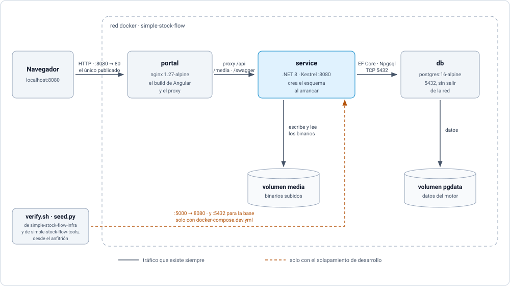
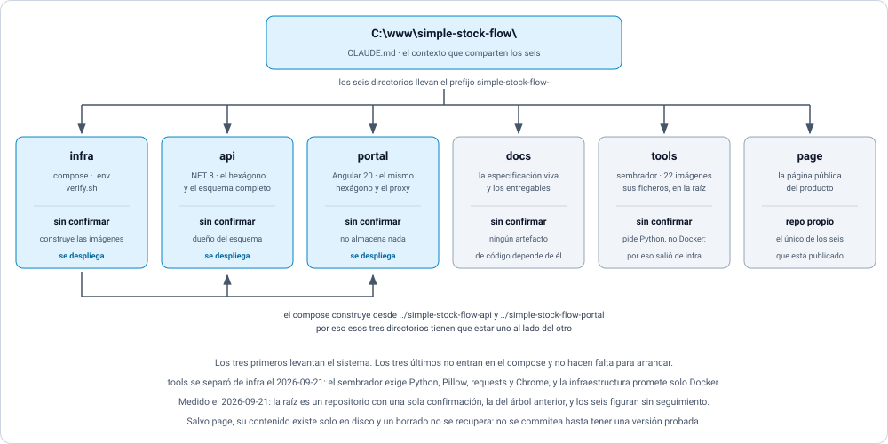
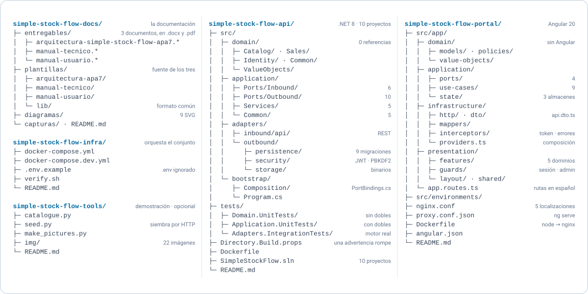
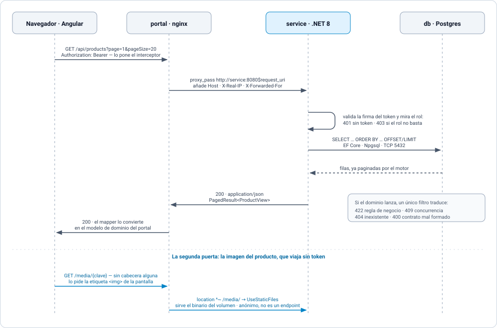
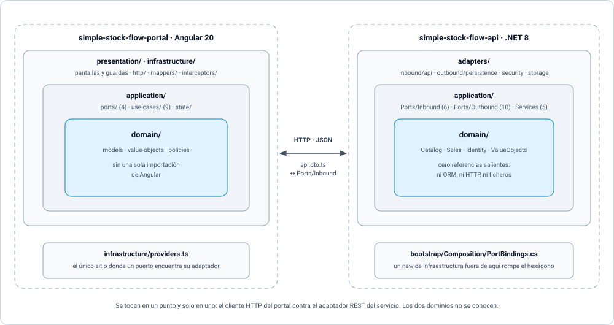
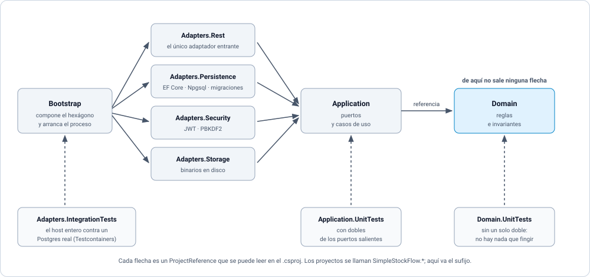
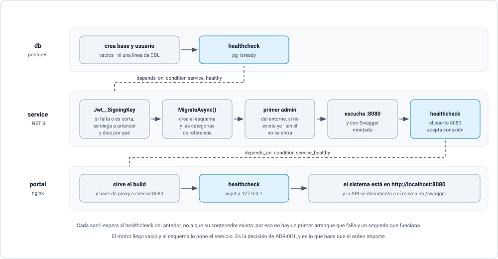

# Arquitectura, vista panorámica

**Qué habla con qué, por dónde y con qué permiso.** Un solo documento para tener el conjunto en la
cabeza antes de abrir cualquier otro.

- **Fecha:** 2026-09-20
- **Alcance:** la forma del sistema y la comunicación entre `simple-stock-flow-infra`,
  `simple-stock-flow-api` y `simple-stock-flow-portal`.
- **De dónde sale cada dibujo:** del `docker-compose.yml`, del `nginx.conf`, de los `.csproj` y del
  arranque del servicio. No de la documentación: se dibujó leyendo el código.

**Lo que este documento no trae, a propósito:**

| No está aquí | Está en |
|---|---|
| El estado del sistema —qué funciona hoy y qué no— | [`../traspaso/HANDOFF.md`](../traspaso/HANDOFF.md) §4, y **solo** ahí |
| La forma exacta de cada petición y cada respuesta | [`api-contract.md`](api-contract.md) |
| El porqué de cada decisión estructural | [`adr`](adr) |
| El detalle de capas, puertos, flujos y riesgos | [`architecture.md`](architecture.md) |

> Aquí está **la forma**, que cambia despacio. Si este documento contradice alguna vez a
> `../traspaso/HANDOFF.md` §4, gana `../traspaso/HANDOFF.md`.

---

## 1. Tres unidades y una sola puerta

*Figura 1 — En producción se publica **un** puerto. Todo lo demás vive dentro de la red de Docker.*

El navegador nunca habla con la API ni con la base: habla con nginx, y nginx reenvía. Eso no es
cosmética de despliegue —es lo que permite que la API no tenga que estar expuesta para que el
sistema funcione—, y es también la razón de que `service` no se pueda renombrar libremente: el
`nginx.conf` del portal reenvía a ese nombre de host.

**El reparto de responsabilidades es la decisión estructural del conjunto** ([ADR-001](adr/adr-001-propiedad-del-esquema.md)):

- **`simple-stock-flow-infra`** levanta el conjunto —red, volúmenes, variables de entorno— y entrega un
  motor **vacío**. Ni una línea de DDL.
- **`simple-stock-flow-api`** trae las reglas de negocio, la API **y el esquema entero** en sus
  migraciones.
- **`simple-stock-flow-portal`** no almacena nada. Solo habla con la API.

**El solapamiento de desarrollo abre dos puertas más**, y por eso existe: `docker-compose.dev.yml`
publica la API en `:5000` y la base en `:5432`. Sin esas dos, ni `verify.sh` puede comprobar la API
directamente, ni el sembrador de `simple-stock-flow-tools` puede sembrar, ni `ng serve` tiene con
quién hablar. El sembrado
entra **por HTTP y nunca por SQL**: los datos de demostración obedecen exactamente las mismas
reglas que lo que teclea una persona.

> Mezclar los dos arranques recrea el contenedor del servicio y le quita el puerto publicado sin
> avisar. Si `:5000` deja de responder de golpe, es eso — está explicado en el README de infra.

---

## 2. El árbol de trabajo

Antes de mirar dentro de ningún repositorio conviene saber cómo está armado el conjunto en disco,
porque la disposición **forma parte del contrato de despliegue** y no es una preferencia de orden.

*Figura 2 — Los seis directorios, su papel y su estado real en git.*

**Tienen que ser hermanos:** el compose construye las imágenes desde
`../../simple-stock-flow-api` y `../../simple-stock-flow-portal`. Clonar uno de los dos por separado, o
anidarlo, deja la construcción sin contexto.

**Solo tres de los seis se despliegan.** `infra`, `api` y `portal` levantan el sistema.
`docs` guarda la especificación y los entregables, `tools` guarda el sembrador y las imágenes de
demostración, y `page` es la página pública del producto. Ninguno de esos tres entra en el compose
ni hace falta para que el sistema arranque.

**`tools` salió de `infra` a propósito.** El README de infraestructura promete que basta con
Docker —«Ni .NET, ni Node, ni un cliente de base de datos»— y el sembrador exige Python, Pillow,
requests y Chrome. Ni el compose ni las comprobaciones de `verify.sh` lo nombraban: era una
herramienta opcional viviendo dentro de la infraestructura, y su salida deja intacta esa promesa.

**Casi nada está confirmado.** Medido el 2026-09-21: la raíz del espacio de trabajo sí es un
repositorio, pero tiene **una sola confirmación** y esa confirmación guarda el árbol anterior, con
los nombres `portal-sales-*`. Los seis directorios de la figura figuran como **sin seguimiento**:
su contenido no está en ninguna confirmación y un borrado no se recupera. El único con historia
propia y remoto es `page`. Es una decisión del propietario, no un descuido: no se commitea hasta
tener una versión funcional probada.

> El README del servicio declara que es **submódulo** del de infraestructura. Hoy no lo es, y no
> puede serlo: un submódulo apunta a un repositorio remoto y a un commit concreto, y aquí no hay
> ni commit ni remoto. Queda como tarea pendiente en `tasks.md`.

*Figura 3 — Lo que hay dentro de cada uno. Los recuentos son los reales, no los previstos.*

Los dos repositorios de código tienen **la misma silueta** —`domain/`, `application/`,
`infrastructure/` o `adapters/`—, y esa coincidencia es el asunto de la §4.

---

## 3. Qué cruza cada frontera

*Figura 4 — Una petición del catálogo, de la pantalla al motor y de vuelta. Abajo, la segunda
puerta: la imagen del producto, que viaja sin token.*

| Tramo | Cómo viaja | Quién autoriza | Qué lleva |
|---|---|---|---|
| Navegador → `portal` | HTTP por el único puerto publicado (`PORTAL_PORT`, 8080 por omisión) | nadie: es el estático | el build de Angular, y después cada llamada |
| `portal` → `service` | `proxy_pass` a `service:8080` dentro de la red, con `/api`, `/media` y `/swagger` | el servicio, con el token que le llega tal cual | JSON |
| `service` → `db` | TCP 5432, EF Core sobre Npgsql | la cadena de conexión del `.env` | SQL, con la agregación del reporte hecha **en el motor** |
| `service` → volumen `media` | sistema de ficheros del contenedor | — | los bytes de las imágenes |
| anfitrión → `service` | HTTP a `:5000`, **solo** con el solapamiento de desarrollo | el mismo token que cualquiera | las sondas de `verify.sh`, que vive en `simple-stock-flow-infra`, y el sembrado de `seed.py`, que vive en `simple-stock-flow-tools` |

**Tres cosas que la lista de endpoints no enseña:**

- **El token no lo pone cada llamada: lo pone un interceptor.** Si hay sesión, `auth.interceptor.ts`
  añade `Authorization: Bearer` a todo lo que sale. Ningún caso de uso del portal sabe que existe
  una cabecera.
- **`/media/{clave}` no es un endpoint.** Lo sirve `UseStaticFiles` sobre el volumen de binarios,
  bajo la misma URL que publica `LocalFileStorage`. Al no estar enrutado **no pasa por la
  autorización**, y no hay forma de protegerlo sin cambiar el mecanismo: es lo que hace que la
  etiqueta `` funcione sin cabeceras. Riesgo aceptado con dueño —`H-6` de
  [`api-contract.md`](api-contract.md) §5—, no un descuido.
- **La traducción de errores ocurre en un solo sitio**, un filtro del adaptador REST. Un `try/catch`
  de negocio en un controlador pondría esa traducción en dos.

El servicio declara además un origen permitido (`Cors__Origins__0`, el del portal). A través del
proxy el navegador no cambia de origen, así que esa política solo entra en juego si alguien llama a
la API desde otra parte.

---

## 4. La misma forma a los dos lados

*Figura 5 — El portal repite el hexágono del servicio, y los dos se tocan en un punto y solo en uno.*

No es simetría decorativa. Es lo que permite probar la política del carrito sin levantar un
servidor, y probar el registro de una venta sin levantar un navegador.

**En cada repositorio hay exactamente un archivo donde un puerto encuentra su adaptador**, y esa es
la propiedad que hay que vigilar: `bootstrap/Composition/PortBindings.cs` en el servicio,
`infrastructure/providers.ts` en el portal. Un `new` de infraestructura fuera de ahí rompe el
hexágono en silencio; cambiar el backend por dobles, en cambio, es cambiar un array.

---

## 5. La regla de dependencia

*Figura 6 — Cada flecha es un `ProjectReference` real. De `Domain` no sale ninguna.*

Esto es lo que hace del hexágono algo comprobable y no un dibujo: **la regla la impone el
compilador**. Un adaptador no puede llamar a otro adaptador porque no lo referencia; el dominio no
puede hablar del ORM porque no lo conoce. Se verifica abriendo los `.csproj`, no confiando en la
disciplina de nadie.

Los tres niveles de prueba caen solos de esa forma: el dominio se prueba **sin un solo doble**
—no hay nada que fingir—, la aplicación con dobles de sus puertos salientes, y los adaptadores
levantando el host entero contra un Postgres real.

---

## 6. El arranque, que es donde el orden importa

*Figura 7 — Cada carril espera al healthcheck del anterior: a que el proceso **responda**, no a que
su contenedor exista.*

Un orden de arranque a secas solo garantiza que el contenedor exista, y esa es la causa más común
de un primer arranque que falla y un segundo que funciona. Aquí las tres puertas están encadenadas
por condición, no por orden.

Dos detalles del carril del medio valen por sí solos:

- **Sin `Jwt__SigningKey`, la API se niega a arrancar**, y dice por qué. No hay valor por omisión:
  firmar con una clave de relleno arrancaría bien y repartiría tokens falsificables, y el fallo
  aparecería lejos de su causa.
- **El esquema y las categorías de referencia los pone la migración**, no un script del contenedor.
  Un script de inicialización de Postgres solo se ejecuta con el volumen vacío: la segunda versión
  del esquema no se aplicaría jamás, y el fallo sería silencioso.

---

## 7. Una divergencia encontrada al dibujar esto

[`architecture.md`](architecture.md) §3.2 declara nueve puertos salientes «más 1
pendiente», y dice que el puerto de lectura del reporte «todavía no existe». **Existe:**
`ISalesReportQuery`, implementado por `SqlSalesReportQuery` y registrado en `PersistenceAdapter`.
Son **diez**, y `SalesReportService` ya recibe filas agregadas por el motor, que es justo lo que
[ADR-004](adr/adr-004-reporte-agregado-y-congelado.md) pedía.

Queda anotado aquí y no corregido allí: el criterio de esta casa es que un documento ajeno lo
corrige su dueño, no quien pasa por delante.
