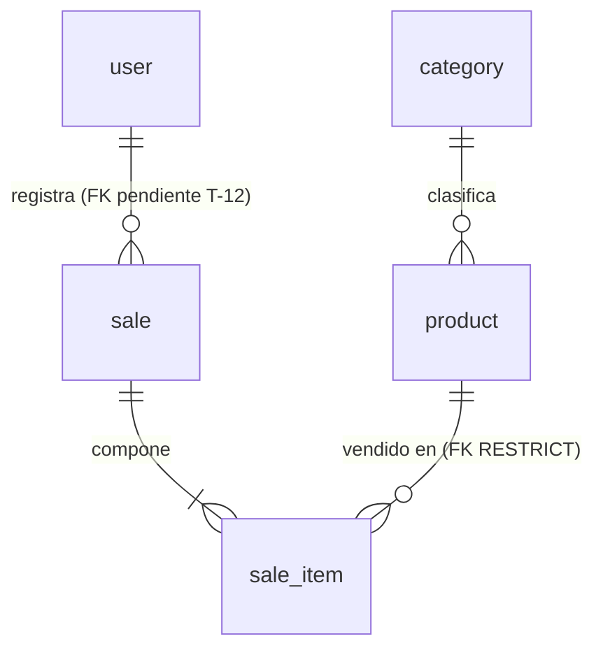

# Modelo de datos — Simple Stock Flow

**El único sitio donde vive el modelo de datos.** Quien implemente no necesita abrir el código ni
conectarse al motor para saber qué hay, de qué tipo, con qué regla y **dónde vive esa regla hoy**.

- **Fecha:** 2026-09-19
- **Verificado contra:** PostgreSQL 16.14 (`simple-stock-flow-db-1`), base `simple_stock_flow`, esquema
  `sales`, servidor en UTC. Las consultas y su salida literal están en [§10](#10-cómo-se-comprueba-que-este-documento-no-miente).
- **Rige bajo:** [`constitution.md`](constitution.md) (innegociable) y [`spec.md`](spec.md) (qué y
  por qué). Las decisiones técnicas D-01…D-10 están en [`plan.md`](plan.md) §1; la forma del
  sistema, en [`architecture.md`](architecture.md); las cuatro decisiones estructurales, en
  [`adr/`](adr/).
- **`plan.md` ya no describe el esquema.** Sus §2 y §3 enlazan aquí. Si algo de allí contradice a
  este documento, gana este documento; si este documento contradice al motor, **gana el motor**
  (artículo X) y el documento está roto.

---

## Cómo se lee este documento

Toda regla del modelo lleva una marca, y **solo hay tres**:

| Marca | Significa |
|---|---|
| **motor** | Existe en Postgres ahora mismo. Un `INSERT` manual la respeta o falla |
| **solo dominio** | La garantiza C# y nada más. **Un `INSERT` por `psql` la salta sin ruido** |
| **pendiente (T-xx)** | No existe todavía. La pone esa tarea de [`tasks.md`](tasks.md) |

**Por qué la tercera columna es el corazón del documento.** Una invariante que solo vive en C#
protege a la aplicación, no a los datos: cualquier `psql`, cualquier migración y cualquier servicio
futuro la saltan sin enterarse. [ADR-002](adr/adr-002-concurrencia-optimista.md) ya fijó el criterio
para `stock >= 0` —*si la restricción salta, algo escribió fuera del adaptador*— y ese criterio vale
para **todas** las invariantes expresables en el motor. Lo que no está aplicado se declara
pendiente; no se promete.

---

## 0. Convención de nombres del esquema

**Las cinco tablas van en singular.** Lo manda la tabla de convenciones de la gobernanza, y el
proyecto se alinea con ella:

| Elemento | Convención | Ejemplo |
|---|---|---|
| Entidad | `PascalCase`, inglés, **singular**, ASCII | `SaleItem` |
| Atributo | `snake_case`, inglés, **singular**, ASCII | `unit_price` |
| Atributo de lista | **Nunca plural** | `sale_item`, no `sale_items` |

La traducción a esquema es directa: `category`, `product`, `sale`, `sale_item`, `user`. **Lo que
pasa a singular es la tabla; el esquema sigue llamándose `sales`**, así que la forma cualificada del
agregado de ventas es `sales.sale`.

**El singular no alcanza al código de objetos, y no es una excepción sino la frontera.** Los nombres
de las clases de dominio (`Product`, `Sale`, `SaleItem`, `User`, `Category`) ya eran singulares y
correctos; las colecciones de C# (`Sale.Items`, `DbSet<Product> Products`) **siguen en plural**
porque nombran conjuntos de objetos, no tablas. Traducir de uno a otro es responsabilidad del
adaptador de persistencia, que es exactamente donde vive el mapeo.

**`user` no obliga a entrecomillar, y está verificado.** Postgres trata `user` como palabra clave
**solo sin cualificar**; en cuanto el nombre lleva esquema delante, lo lee como identificador:

```sql
create table sales."user"(id int);
select * from sales.user;   -- funciona, SIN comillas
```

Todas las consultas de este proyecto van precedidas de `sales.`, así que el problema no se plantea
—y EF entrecomilla por su cuenta de todos modos—. **El motivo es que el esquema cualifica, no que
el nombre sea plural**: cualquier documento que dé la otra razón está equivocado, aunque acierte en
la conclusión.

**Escribir y ver no son lo mismo, y conviene no confundirlos.** Postgres **no exige** las comillas
al escribir, pero **sí las imprime** al renderizar el identificador por su cuenta: en §10.2 y §10.3
la tabla sale como `sales."user"`, no como `sales.user`. Es cosmética del catálogo, no una
obligación de sintaxis, y no hay ninguna consulta de este proyecto que tenga que entrecomillarla.

> El otro eje de la convención —qué nombres genera EF y cuáles se escriben a mano— está en
> [§3.1](#31-convención-de-nombres--hoy-conviven-dos-estilos).

---

## 1. Glosario del dominio

En lenguaje de negocio. El código y los nombres de columna van en inglés (artículo XI); la columna
técnica indica dónde vive cada término.

| Término (negocio) | Definición funcional | Dónde vive (técnico) |
|---|---|---|
| **Producto** | Artículo del catálogo. Tiene **nombre, precio, stock, categoría e imagen opcional, y nada más** (DP-03) | `Product` · tabla `product` |
| **Categoría** | Clasificación a la que pertenece un producto. Conjunto **fijo de cinco**, sembrado, sin mantenimiento (D-10) | `Category` · tabla `category` |
| **Precio** | Valor monetario vigente del producto en el catálogo. Estrictamente positivo | `Money` (objeto de valor) · columna `product.price` |
| **Stock** | Unidades disponibles del producto. Nunca negativo | `product.stock` |
| **Imagen del producto** | **Clave opaca** del binario en el almacenamiento externo. Ni el binario ni una ruta (D-08). Ausente se representa con `NULL`, nunca con cadena vacía | `product.image_key` |
| **Venta** | Hecho comercial consumado e **inmutable**: quién, cuándo y qué. Una vez registrada no se edita ni se borra | `Sale` · tabla `sale` |
| **Línea de venta** | Renglón de la venta: producto, cantidad y **precio congelado** del momento. No existe fuera de su venta | `SaleItem` · tabla `sale_item` |
| **Cantidad** | Unidades vendidas en una línea. Estrictamente positiva | `Quantity` (objeto de valor) · `sale_item.quantity` |
| **Total de la venta** | Suma de subtotales. **Se calcula, no se almacena** (artículo VII) | `Sale.Total` · **sin columna** |
| **Subtotal de la línea** | Precio unitario por cantidad. **Se calcula, no se almacena** | `SaleItem.Subtotal` · **sin columna** |
| **Usuario** | Operador interno que se autentica y registra ventas. **No hay entidad cliente ni comprador** | `User` · tabla `user` |
| **Rol** | Atribución del usuario en un conjunto cerrado de dos: `admin` o `seller` | `user.role` |
| **Hash de clave** | Huella irreversible de la contraseña. El dominio **nunca ve la clave en claro** (D-09) | `user.password_hash` |
| **Rango de fechas** | Ventana temporal del reporte. El fin no puede ser anterior al inicio | Objeto de valor de la capa de aplicación · **sin tabla** |
| **Reporte de ventas** | Agregación por producto sobre un rango. **No se persiste**: se calcula en el motor por un puerto de lectura (D-06) | Modelo de lectura · **sin tabla** |

**Nombre congelado.** Cuando este documento dice que un valor está *congelado*, significa que la
línea de venta guarda una **copia del valor en el instante de la venta** y esa copia no sigue al
catálogo. No es desnormalización: el precio de venta y el nombre vendido son **hechos propios de la
venta**, no atributos del producto leídos tarde. Es lo que permite renombrar o reprecificar un
producto sin reescribir reportes de períodos cerrados.

**Adaptado del recuperado, con dos correcciones.** El glosario del documento recuperado
`data/data-model.md` §2 incluía *moneda de la venta* como término; **el sistema es monomoneda por
construcción** (D-05) y no hay columna de moneda en ninguna tabla. Y su definición de Producto
dejaba la puerta abierta a atributos adicionales; **DP-03 la cierra**: nombre, precio, stock,
categoría e imagen. Sin descripción, sin SKU, sin código de referencia.

---

## 2. Las cinco entidades y sus invariantes

**Cinco entidades, cinco tablas, sin excedente.** No hay tabla de reporte, ni de auditoría, ni de
contadores, ni tablas para los objetos de valor —que no tienen identidad y viven dentro de la fila
de su dueño (D-07)—.



### 2.1 `Category` — entidad de referencia

| Invariante | Quién la hace cumplir | Marca |
|---|---|---|
| Nombre obligatorio y no vacío; se guarda recortado | `Category.Rename` | **solo dominio** · baja al motor en T-20 |
| Nombre único | Índice único `IX_category_name` | **motor** |

**No es raíz de agregado y no tiene ciclo de vida.** Su repositorio es de **solo lectura**: ningún
puerto crea, renombra ni borra categorías. Las cinco filas nacen en la migración inicial ([§9](#9-estrategia-de-semilla)).

### 2.2 `Product` — raíz de agregado (catálogo)

| Invariante | Quién la hace cumplir | Marca |
|---|---|---|
| Nombre obligatorio y no vacío; se guarda recortado | `Product.Rename` | **solo dominio** (`NOT NULL` sí está en el motor; *no vacío* no) |
| `price > 0` | `Product.ChangePrice` | **solo dominio** · T-20 |
| `stock >= 0` tras cualquier operación | `Product.Withdraw` / `Product.Restock` | **motor** — `ck_product_stock_non_negative`, la última barrera de ADR-002 |
| Retirar más stock del disponible falla | `Product.Withdraw` | **solo dominio** — es una regla de proceso, no expresable en un `CHECK` |
| Categoría obligatoria y existente | `Product.SetCategory` + `FK_product_category_category_id` | **motor** |
| `image_key` ausente ⇒ `NULL`, nunca cadena vacía | `Product.AttachImage` normaliza en blanco a `null` | **solo dominio** · *no hay* regla equivalente pendiente: el `NULL` es la única representación y basta con `image_key IS NULL` |
| Nunca se borra físicamente: baja lógica | Propiedad sombra `deleted_at` + filtro global | **motor** desde T-09 · la columna existe y el filtro global la aplica — ver [ADR-003](adr/adr-003-baja-logica.md) |

**`Money` admite importe cero y esto importa.** Su constructor rechaza solo los negativos, así que
`new Money(0)` es válido. La única guarda de `price > 0` es `Product.ChangePrice`: un producto a
precio 0 insertado por `psql` hoy pasa. Es exactamente el hueco que cierra el `CHECK` de T-20.

**La regla de redondeo vive en `Money`, no en la columna.** `Money` redondea a **2 decimales con
`MidpointRounding.AwayFromZero`** antes de guardar; la columna es `numeric(18,2)`. Coinciden por
construcción, no por casualidad. **Si una cambia, la otra cambia en la misma migración**: con más
decimales en la columna la precisión extra sería siempre cero, y con más decimales en `Money` el
motor recortaría por su cuenta y el importe leído dejaría de ser el escrito.

### 2.3 `Sale` — raíz de agregado (ventas)

| Invariante | Quién la hace cumplir | Marca |
|---|---|---|
| Registra quién la realiza; obligatorio y no vacío | Constructor de `Sale` | **solo dominio** (`NOT NULL` sí está en el motor) |
| **Al menos una línea** para poder confirmarse | `Sale.EnsureConfirmable` | **solo dominio** — no expresable en un `CHECK`; exigiría un disparador diferido |
| **Un producto no se repite** dentro de la misma venta | `Sale.AddItem` rechaza el duplicado | **solo dominio** *y ahora también* **motor**: el índice único `(sale_id, product_id)` existe desde T-20, con `INCLUDE (quantity, unit_price)` |
| Descontar stock y añadir la línea son **una sola operación** | `Sale.AddItem` llama a `Product.Withdraw` antes de añadir | **solo dominio** — es la regla que da sentido al agregado |
| Inmutable una vez registrada | No existe puerto de edición ni de borrado | **solo dominio** (por ausencia de operación) |

**La venta no conoce la moneda.** El total se calcula sumando subtotales y `Money` exige la misma
moneda al sumar; como el mapeo reconstruye siempre la moneda por defecto, hoy no puede fallar. **La
guarda explícita en `Sale.AddItem` es deuda barata y tiene tarea: T-05.**

### 2.4 `SaleItem` — entidad interna del agregado `Sale`

| Invariante | Quién la hace cumplir | Marca |
|---|---|---|
| Producto obligatorio | Constructor de `SaleItem` + `NOT NULL` | **motor** · `NOT NULL` y la **FK** `FK_sale_item_product_product_id` con `RESTRICT`, puesta por T-20 |
| `quantity > 0` | Constructor de `Quantity` | **solo dominio** · T-20 |
| Nombre y precio **congelados** en el instante de la venta | `Sale.AddItem` copia de `Product` | **solo dominio**, por construcción |
| Nombre de **categoría congelado** | Constructor de `SaleItem` + `NOT NULL` | **motor** (T-11) · `sale_item.category_name`, sin clave foránea a propósito — D-06 y [ADR-004](adr/adr-004-reporte-agregado-y-congelado.md) |
| **No existe fuera de su venta** | `FK_sale_item_sale_sale_id ON DELETE CASCADE` | **motor** entero: la cascada y el `sale_id NOT NULL` que la completa, puesto por T-20 |

**No se construye desde fuera.** Su constructor es `internal` y solo `Sale.AddItem` lo invoca: no
hay forma legítima de fabricar una línea suelta.

### 2.5 `User` — raíz de agregado (identidad)

| Invariante | Quién la hace cumplir | Marca |
|---|---|---|
| Nombre de usuario obligatorio y **único** | Constructor + índice único `IX_user_username` | **motor** (unicidad) |
| Nombre de usuario **en minúsculas y recortado** | `User.NormalizeUsername` | **solo dominio** · T-20 |
| Hash de clave obligatorio y no vacío | Constructor de `User` | **solo dominio** (`NOT NULL` sí está en el motor) |
| `role` en `('admin','seller')` | `Roles.IsValid` | **solo dominio** · T-20 |
| El dominio **nunca ve la clave en claro** | El hash lo produce un puerto (D-09) | Por diseño del hexágono |

**Por qué la normalización es una invariante y no una comodidad.** Una búsqueda que se saltara
`NormalizeUsername` dejaría registrar `"Ana "` como cuenta nueva que **nunca podría iniciar
sesión**: el agregado la guardaría como `ana` y chocaría con la existente.

---

## 3. Modelo físico — las 22 columnas

Esquema `sales` de la base `simple_stock_flow`. **Ninguna columna tiene `DEFAULT`, y es deliberado: los
valores los pone el dominio**, nunca el motor —un defecto del motor sería una segunda fuente de
verdad que nadie prueba—. Los tipos son los que devuelve `information_schema.columns` hoy; la salida
literal está en [§10](#10-cómo-se-comprueba-que-este-documento-no-miente).

**Tablas en singular, sin excepción**, según la convención de
[§0](#0-convención-de-nombres-del-esquema). Ahí está el porqué y la verificación de `user`; aquí no
se repite.

**`category`** — datos semilla de solo lectura (D-10).

| Columna | Tipo | Nulable | Defecto | Nota |
|---|---|---|---|---|
| `id` | `uuid` | no | ninguno | Clave primaria. Identificadores literales en la migración, para que las pruebas los referencien ([§9](#9-estrategia-de-semilla)) |
| `name` | `varchar(120)` | no | ninguno | Único |

**`product`**

| Columna | Tipo | Nulable | Defecto | Nota |
|---|---|---|---|---|
| `id` | `uuid` | no | ninguno | Clave primaria |
| `name` | `varchar(200)` | no | ninguno | El dominio lo recorta antes de guardar |
| `price` | `numeric(18,2)` | no | ninguno | Solo el importe: **sin columna de moneda** (D-05). 16 dígitos enteros, de sobra para el alcance |
| `stock` | `integer` | no | ninguno | |
| `category_id` | `uuid` | no | ninguno | Clave foránea restrictiva a `category` — [§5](#5-política-de-claves-foráneas) FK-1 |
| `image_key` | `varchar(512)` | **sí** | ninguno | Clave opaca, nunca ruta ni bytes (D-08) |
| `category_name` | `varchar(120)` | no | ninguno | **motor** (T-11) · la etiqueta congelada en el instante de la venta. **Sin clave foránea a propósito**: si la tuviera, renombrar la categoría reescribiría el histórico, que es justo lo que ADR-004 prohíbe. Mismo ancho que `category.name`, y **las dos se mueven juntas** |
| `deleted_at` | `timestamptz` | sí | ninguno | **motor** (T-09, verificado contra `information_schema`: nulable, sin defecto) · propiedad sombra, sin propiedad en el agregado (D-03). Nula mientras el producto está activo: así sirve de predicado a los índices parciales |
| `xmin` | `xid` | — | — | **Columna de sistema del motor**, no del esquema. Postgres la incrementa en cada `UPDATE`. Es el testigo de concurrencia de D-04, expuesto como propiedad sombra (T-10). **No aparece en `information_schema` porque no es una columna declarada**, así que no cuenta entre las 21 |

**`sale`** — el esquema `sales` agrupa el sistema entero; la tabla `sale` nombra el agregado. **El
singular deshace la colisión que había**: hasta el renombrado existía una tabla `sales` dentro del
esquema `sales` y la cualificación era `sales.sales`. Hoy es `sales.sale`, y el prefijo no cambia:
**lo que pasa a singular es la tabla, nunca el esquema**.

| Columna | Tipo | Nulable | Defecto | Nota |
|---|---|---|---|---|
| `id` | `uuid` | no | ninguno | Clave primaria |
| `sold_at` | `timestamptz` | no | ninguno | Instante de la venta. **Es el único instante de negocio del sistema** ([§8](#8-auditoría-created_at--updated_at)) |
| `sold_by` | `varchar(120)` | no | ninguno | **Hoy se llama así.** Se renombra a `sold_by_username` en **T-12** (ver nota abajo) |
| `sold_by_user_id` | `uuid` | no | ninguno | **pendiente (T-12)** · clave foránea restrictiva a `user.id` — FK-4 |

**`sale_item`**

| Columna | Tipo | Nulable | Defecto | Nota |
|---|---|---|---|---|
| `id` | `uuid` | no | ninguno | Clave primaria |
| `product_id` | `uuid` | no | ninguno | **Sin clave foránea hoy** — FK-3, [§5](#5-política-de-claves-foráneas) |
| `product_name` | `varchar(200)` | no | ninguno | Copia congelada de `product.name`, **misma longitud a propósito** |
| `quantity` | `integer` | no | ninguno | |
| `unit_price` | `numeric(18,2)` | no | ninguno | Copia congelada del precio. **Una sola columna**: sin `unit_price_currency` (D-05) |
| `sale_id` | `uuid` | **sí — es un defecto** | ninguno | Debe pasar a `NOT NULL`: una línea sin venta no significa nada, contradice la cascada ya configurada y deja inservible el compuesto único. Causa: `HasForeignKey("sale_id")` crea una propiedad sombra y EF la hace nulable si la relación no declara `IsRequired()` |
| `category_name` | `varchar(120)` | no | ninguno | **pendiente (T-11)** · longitud igual a `category.name` porque es una copia congelada de ese valor (D-06). `NOT NULL` **es gratis hoy porque la tabla está vacía**; deja de serlo con la primera venta, y entonces la migración necesita un relleno |

**`user`**

| Columna | Tipo | Nulable | Defecto | Nota |
|---|---|---|---|---|
| `id` | `uuid` | no | ninguno | Clave primaria |
| `username` | `varchar(120)` | no | ninguno | Único. Se guarda en minúsculas y recortado |
| `password_hash` | `varchar(512)` | no | ninguno | **Nunca se indexa** ([§7](#7-privacidad-y-retención)) |
| `role` | `varchar(40)` | no | ninguno | Conjunto cerrado: `admin`, `seller` |

**Dos reglas transversales, escritas para que nadie las infiera.**

1. **Sin columna de moneda en ninguna tabla: el sistema es monomoneda** (D-05). No se reintroduce.
2. **Todas las marcas de tiempo son `timestamptz`, sin excepción.** El servidor corre en UTC. Quien
   añada una columna de fecha nueva no tiene que deducirlo de `sold_at`.

**Sobre los dos nombres de `sold_by`.** La columna se llama `sold_by` en el motor y `Sale.SoldBy` en
el dominio. **Se alinea el código con el nombre largo y no al revés**, porque en cuanto T-12 añada
`sold_by_user_id` al lado, `sold_by` a secas no dirá cuál de los dos es. El renombrado **no toca el
contrato de la API** —el campo que viaja es `SaleView.SoldBy` y no cambia— y es barato ahora porque
la tabla está vacía.

### 3.1 Convención de nombres — hoy conviven dos estilos

Lo que genera EF conserva su estilo: `PK_`, `IX_`, `FK_`, en `PascalCase` y entrecomillado. Lo que
se escribe a mano —que hoy son **solo los `CHECK`**— va en `snake_case` con el patrón
`ck_{tabla}_{regla}`, como el `ck_product_stock_non_negative` que ya existe. **Las dos convenciones
son deliberadas:** renombrar lo que genera EF obligaría a mantener una lista paralela de nombres en
cada migración.

**Los nombres derivados siguen a la tabla.** Al pasar las tablas a singular ([§0](#0-convención-de-nombres-del-esquema)),
EF regenera los suyos —`PK_product`, `IX_category_name`, `FK_sale_item_sale_sale_id`— sin que nadie
los escriba. **El único que hay que renombrar a mano es el `CHECK`**, precisamente porque no lo
genera EF: `ck_products_stock_non_negative` pasó a `ck_product_stock_non_negative`. Dejarlo con el
nombre viejo habría sido el único objeto del esquema en plural.

### 3.2 Migraciones aplicadas

Cuatro, no una. El esquema lo poseen las migraciones de EF y **nada más** ([ADR-001](adr/adr-001-propiedad-del-esquema.md)).

| Migración | Qué hace | Tarea |
|---|---|---|
| `20260919175513_InitialSchema` | Las cinco tablas, las dos claves foráneas, los índices únicos y de acceso, y **las cinco categorías semilla dentro** | T-02 |
| `20260919194003_StockNonNegative` | El único `CHECK` del esquema | T-10 |
| `20260919203018_AccentSeedCategoryNames` | Corrige el acento de una categoría sembrada: *Fontaneria* → *Fontanería* | T-02 |
| `20260919215344_RenameTablesToSingular` | Las cinco tablas pasan a singular ([§0](#0-convención-de-nombres-del-esquema)). Con ellas, los nombres que EF deriva —claves primarias, índices y claves foráneas— y, **a mano, el único `CHECK`**: `ck_products_stock_non_negative` → `ck_product_stock_non_negative`. **Ninguna columna se renombra** | T-02 |

**El renombrado es una migración y no un retoque del documento.** Va por el mismo camino que todo el
DDL del sistema —ADR-001 no admite otro— y se aplicó con `product`, `sale` y `sale_item` **vacías**,
`category` con 5 filas y `user` con 1: un `ALTER TABLE ... RENAME TO` instantáneo. Con la primera
venta real seguiría siendo posible, pero ya no gratis.

El historial vive en `public."__EFMigrationsHistory"` —**fuera del esquema `sales`**, que es por lo
que la consulta de columnas devuelve 21 y no más—.

---

## 4. Restricciones e índices: dónde vive cada regla

**Hoy el esquema tiene ocho restricciones: cinco claves primarias, dos claves foráneas y un solo
`CHECK`.** Las dos unicidades (`category.name`, `user.username`) las impone el motor mediante
**índice único**, no mediante restricción, así que no salen en `pg_constraint` pero **sí se
cumplen**. Todo lo demás es dominio o es pendiente.

| Regla | Objeto en el motor | Dónde vive hoy |
|---|---|---|
| Clave primaria de las 5 tablas | `PK_category`, `PK_product`, `PK_sale`, `PK_sale_item`, `PK_user` | **motor** |
| `category.name` único | `IX_category_name` (índice único) | **motor** |
| `user.username` único | `IX_user_username` (índice único) | **motor** |
| `product.category_id` → `category.id`, `ON DELETE RESTRICT` | `FK_product_category_category_id` | **motor** |
| `sale_item.sale_id` → `sale.id`, `ON DELETE CASCADE` | `FK_sale_item_sale_sale_id` | **motor** |
| `product.stock >= 0` | `ck_product_stock_non_negative` | **motor** — la última barrera de ADR-002 |
| `product.price > 0` | — | **solo dominio** · `Product.ChangePrice`. La baja al motor es **T-20**. Ver `Money` en [§2.2](#22-product--raíz-de-agregado-catálogo) |
| `sale_item.quantity > 0` | — | **solo dominio** · constructor de `Quantity`. La baja al motor es **T-20** |
| `category.name` no vacío | — | **solo dominio** · `Category.Rename`. La baja al motor es **T-20** |
| `user.role` en `('admin','seller')` | — | **solo dominio** · `Roles.IsValid`. La baja al motor es **T-20** |
| `user.username` en minúsculas | — | **solo dominio** · `User.NormalizeUsername`. La baja al motor es **T-20** |
| `sale_item.sale_id NOT NULL` | `sale_item.sale_id` | **motor** (T-20) · era el prerrequisito del compuesto único, y por eso fue primero |
| Único `(sale_id, product_id)` | `IX_sale_item_sale_id_product_id` | **motor** (T-20) · **no puede cumplir su función mientras `sale_id` admita nulos:** en un índice único cada `NULL` es distinto de cualquier otro, así que dos líneas con `sale_id` nulo y el mismo producto conviven sin protestar |
| `sale_item.product_id` → `product.id`, `ON DELETE RESTRICT` | `FK_sale_item_product_product_id` | **motor** (T-20) · **No es una decisión nueva: ADR-003 ya se apoya en ella** como *barrera de última instancia para que un borrado manual falle ruidosamente*. Nunca se implementó, y hoy `sale_item` no tiene **ninguna** clave foránea hacia el catálogo |
| `sale.sold_by_user_id` → `user.id`, `ON DELETE RESTRICT` | — | **pendiente (T-12)** · la autoría de una venta no puede quedar huérfana |
| Índices de acceso (`product`, `sale`, `sale_item`) | ver [§6.2](#62-índices-los-que-hay-y-los-que-faltan) | Tres existen, tres faltan — **§6.2 los separa uno por uno** |

**Bajar al motor las cinco invariantes marcadas *solo dominio* es la deuda concreta de este
documento, y tiene tarea: T-20.** No cambia ni una línea de dominio: son cinco `CHECK` y un índice.
Lo que cambia es que dejan de depender de que todo el mundo pase por el adaptador.

### 4.1 Acentos y mayúsculas en `category.name`: la unicidad se queda sensible a ambos

*Fontanería* y *Fontaneria* son dos filas válidas, y *Pinturas* y *pinturas* también. **Se acepta a
sabiendas y por escrito, no por descuido:** las cinco categorías son datos semilla de solo lectura,
no hay CRUD de categorías y ningún puerto las crea, así que **nadie puede provocar la colisión por
la interfaz**. La alternativa —`citext`, o un índice único sobre `unaccent(lower(name))`— añade una
extensión al despliegue para proteger una tabla en la que nadie escribe.

**Condición de revisión, explícita: si algún día se abre el mantenimiento de categorías, esta
decisión se revisa antes de escribir ese CRUD.**

---

## 5. Política de claves foráneas

**Cuatro relaciones, cuatro claves foráneas previstas. Hoy existen dos.** Esta tabla es la política
completa: el `ON DELETE` de cada una, su `ON UPDATE`, y **por qué**.

| # | Clave foránea | Referencia | `ON DELETE` | `ON UPDATE` | Estado | Por qué esa acción |
|---|---|---|---|---|---|---|
| **FK-1** | `product.category_id` | `category.id` | **`RESTRICT`** | `NO ACTION` | **motor** | Una categoría con productos no se elimina. Hoy es teórico —no hay puerto de borrado de categorías— pero **la restricción debe existir antes de que lo haya**, no después |
| **FK-2** | `sale_item.sale_id` | `sale.id` | **`CASCADE`** | `NO ACTION` | **motor** | Composición pura: la línea no tiene vida fuera de su venta. **En la práctica nunca se dispara**, porque las ventas no se borran ([§7.1](#71-retención)). Está para que el modelo diga la verdad sobre la naturaleza de la relación, no para usarse |
| **FK-3** | `sale_item.product_id` | `product.id` | **`RESTRICT`** | `NO ACTION` | **motor** (T-20) | **Barrera de última instancia.** Un borrado físico jamás debe poder huerfanar una línea de venta ni romper el reporte. Con la baja lógica de ADR-003 nunca se dispara; existe para que un `DELETE` manual o un cambio de código futuro **falle ruidosamente** en vez de corromper el histórico |
| **FK-4** | `sale.sold_by_user_id` | `user.id` | **`RESTRICT`** | `NO ACTION` | **pendiente (T-12)** | La autoría de una venta es un dato contable. Un usuario con ventas no se elimina |

**`ON UPDATE NO ACTION` en las cuatro, y es una decisión, no un descuido.** Todas las claves
primarias son UUID generados por la aplicación y **jamás cambian**. No existe escenario de
actualización de clave, así que un `CASCADE` en `UPDATE` sería maquinaria muerta que ocultaría un
error el día que se disparase. Verificado: `pg_get_constraintdef` no imprime cláusula `ON UPDATE`
para las dos existentes, que es como Postgres representa `NO ACTION` ([§10](#10-cómo-se-comprueba-que-este-documento-no-miente)).

**La contradicción que este documento cierra.** [ADR-003](adr/adr-003-baja-logica.md) razona sobre
FK-3 como si existiera —la llama barrera de última instancia— y **nunca se implementó**. Hasta hoy
ningún documento de `simple-stock-flow-docs` lo decía. Queda dicho, con marca y con tarea.

**Cardinalidades y naturaleza de cada relación:**

| Origen | Destino | Cardinalidad | Naturaleza | Regla de negocio |
|---|---|---|---|---|
| `category` | `product` | 1:N | Cruce de agregado, por identidad de raíz | Todo producto pertenece a **exactamente una** categoría, y es obligatoria. Una categoría puede existir sin productos |
| `sale` | `sale_item` | 1:N | **Interna al agregado** (composición) | Una venta persistible tiene **al menos una** línea. Las líneas no existen fuera de su venta |
| `sale_item` | `product` | N:1 | Cruce de agregado, por identidad de raíz | Toda línea apunta a un producto existente y **no dado de baja en el momento de la venta** |
| `sale` | `user` | N:1 | Cruce de agregado, por identidad | Toda venta se atribuye a un usuario existente. La autoría no puede quedar huérfana |

**Relaciones N:M: exactamente una.** `sale` ↔ `product`, resuelta por la entidad asociativa
`sale_item`, que porta datos propios (`quantity`, `unit_price`, `product_name` y, con T-11,
`category_name`). **No se introduce ninguna otra tabla puente.** `user` ↔ `role` **no** es N:M: es
un valor único por usuario dentro de un conjunto cerrado de dos.

---

## 6. Patrones de acceso e índices

> Un índice existe porque una consulta concreta lo necesita. Los que no se ponen **también se
> justifican**: un índice de más encarece cada escritura para siempre.

### 6.1 Patrones de acceso reales

Derivados de los puertos, no imaginados:

| # | Patrón | Tabla | Filtro | Orden | Página | Frecuencia |
|---|---|---|---|---|---|---|
| Q1 | Buscar producto | `product` | texto parcial, categoría, **activos** | nombre | Sí | **Alta** |
| Q2 | Producto por identificador | `product` | clave primaria | — | No | Alta |
| Q3 | Productos por lote de identificadores | `product` | lote, **activos** | — | No | **Alta** |
| Q4 | Listar categorías | `category` | — | nombre | No | Alta |
| Q5 | Categoría por identificador | `category` | clave primaria | — | No | Media |
| Q6 | Venta con sus líneas | `sale` + `sale_item` | clave y reunión | — | No | Media |
| Q7 | Ventas por rango | `sale` | rango de fecha | fecha desc | Sí | Alta |
| Q8 | Ventas por rango sin paginar | `sale` | rango | — | **No** | Baja — ver abajo |
| Q9 | **Reporte agregado** | `sale` ⋈ `sale_item` | rango, agrupa por producto | importe desc | No | **Alta. La más costosa** |
| Q10 | Usuario por nombre | `user` | igualdad exacta | — | No | **Alta, en cada inicio de sesión** |

**Q3 es el punto de contención de D-04:** es la lectura que precede a la escritura de stock.
**Q1 y Q7 implican una consulta de conteo adicional** cada una, porque devuelven el total de
elementos. **Q8 no tiene consumidor** si el reporte agrega en el motor, que es como debe resolverse:
sobra, y conviene retirarlo del puerto en vez de dejarlo como trampa.

### 6.2 Índices: los que hay y los que faltan

**No faltan cinco, faltan tres.** `sale (sold_at)` y `sale_item (product_id)` **ya existen** desde
la migración inicial, y los dos únicos de integridad también. La cuenta anterior los daba por
pendientes; contrastar con `pg_indexes` ([§10](#10-cómo-se-comprueba-que-este-documento-no-miente))
la deshace en un segundo.

| Índice | Sirve a | Estado | Nota |
|---|---|---|---|
| `product (category_id, name)` **parcial sobre activos** | Q1 | **falta (T-13)** | Sustituye a `IX_product_category_id` e `IX_product_name`, que hoy existen sueltos: **se sustituyen, no se suman**. El predicado sale gratis en vez de costar un filtro. Depende de T-09, que crea la columna de baja |
| `product (name)` con trigramas, **parcial sobre activos** | Q1 | **falta (T-13)** | **Ningún árbol B sirve un comodín a la izquierda.** Es el único índice cuyo valor depende del volumen: **el primero que se cae** si se objeta la extensión |
| `sale_item (sale_id, product_id)` **único, incluyendo cantidad e importe** | Unicidad, Q6, **Q9** | **falta (T-13)** | Con las dos columnas incluidas, **la agregación del reporte no toca la tabla**. Es la única optimización deliberada del diseño. **Exige antes `sale_id NOT NULL`** ([§4](#4-restricciones-e-índices-dónde-vive-cada-regla)): con nulos, la unicidad no protege nada |
| `sale (sold_at)` | Q7, Q9 | **ya existe** — `IX_sale_sold_at`, ascendente | **Y está bien así.** Ver la nota sobre el `DESC` justo debajo |
| `sale_item (product_id)` | Q9 y la verificación de FK-3 | **ya existe** — `IX_sale_item_product_id` | El motor indexa el lado referenciado, **nunca el referenciante**. Hoy protege una consulta; el día que exista FK-3, también protege su verificación |
| `category (name)` único · `user (username)` único | Integridad primero, Q4 y Q10 después | **ya existen** — `IX_category_name`, `IX_user_username` | Índices únicos, no restricciones: por eso no salen en `pg_constraint` |
| `sale_item (sale_id)` suelta | — | **existe y sobra** — `IX_sale_item_sale_id` | **Se borra en la misma migración que crea el compuesto único**, que la deja redundante. Borrarla es parte de T-13, no un paso opcional |

**Sobre el `DESC` de `sale (sold_at)`: era cosmético, y conviene saber por qué.** En un índice de
**una sola columna** el sentido de ordenación no cambia nada: Postgres recorre cualquier árbol B
hacia atrás sin coste añadido, así que `IX_sale_sold_at` ascendente sirve `ORDER BY sold_at DESC`
igual de bien. El `DESC` solo se justificaría en un índice **compuesto**, donde los sentidos tienen
que coincidir con los del `ORDER BY` para evitar una ordenación. **No se toca el índice existente**,
y esta nota se queda para que nadie lo "arregle" más adelante.

**Quién instala `pg_trgm`.** La extensión **no está instalada**: `SELECT extname FROM pg_extension`
devuelve solo `plpgsql` ([§10](#10-cómo-se-comprueba-que-este-documento-no-miente)). La instala **la
propia migración de EF que crea el índice de trigramas**, en la misma migración y no en otra: si el
`CREATE EXTENSION` y el `CREATE INDEX` se separan, existe un estado intermedio en el que la
migración del índice falla. **No puede ir en `db/init/` ni en ninguna otra pieza de infraestructura,
porque ADR-001 reserva todo el DDL a las migraciones** — el repositorio de infraestructura levanta
el motor, no define el esquema. Es viable sin superusuario: `pg_trgm` es una extensión *trusted* en
Postgres 16, así que el propietario de la base puede instalarla. **T-13 debe decirlo.**

### 6.3 Índices descartados, y por qué

| Columna | Por qué **no** |
|---|---|
| `deleted_at` suelta (pendiente T-09) | Dos estados efectivos y casi todas las filas en uno. Su lugar es **dentro** del predicado parcial, que es donde aporta |
| `user.role` | Enumeración de dos valores sobre una tabla de operadores internos. Ningún patrón filtra por rol |
| `product.stock` | **Ningún patrón filtra ni ordena por stock.** Se lee siempre por identificador |
| `sale.sold_by_user_id` (pendiente, T-12) | Ningún patrón lo usa. Y la consulta que lo justificaría —ventas por operador— **cruza datos personales**: no se preconstruye el índice de una consulta que el negocio ya decidió no hacer (**DP-02**) |
| `sale_item (sale_id)` suelta | **Redundante:** ya es la columna principal del índice único. Con el matiz de que **hoy existe** y hay que **borrarla** en la migración que cree el compuesto, no solo evitar crearla |
| `product.image_key` | Nunca aparece en un filtro. Es una clave opaca que solo se lee para resolver una dirección |
| `user.password_hash` | **Nunca se indexa, y no es una cuestión de rendimiento** ([§7](#7-privacidad-y-retención)) |

**Salvedad honesta sobre las columnas incluidas.** El recorrido solo-índice exige que el mapa de
visibilidad esté al día. En una tabla que **solo recibe inserciones**, el mantenimiento automático
se dispara poco, así que las filas recién insertadas **sí** provocan lectura de la tabla hasta el
siguiente barrido. La mitigación es operativa, no de diseño.

---

## 7. Privacidad y retención

> Se clasifica **atributo por atributo**, no por tabla. Un "esta tabla tiene datos personales" no
> dice qué se puede registrar en un log ni qué puede salir en una respuesta.

| Tabla | Atributo | Clasificación | Manejo exigido | Retención |
|---|---|---|---|---|
| `user` | `id` | No sensible | Identificador opaco | Indefinida |
| `user` | `username` | **Dato personal — identifica a una persona** | Acceso restringido. Admisible en auditoría; **no** en respuestas anónimas ni en endpoints públicos | Indefinida, sin borrado |
| `user` | `password_hash` | **Secreto de autenticación** (no es dato personal, y exige más) | **Jamás** en logs, respuestas, proyecciones ni mensajes de error. **Nunca se indexa.** Su única lectura legítima es verificar, a través del puerto de hash | Sin histórico ni versionado |
| `user` | `role` | Confidencial interno | Revela el nivel de privilegio. No es personal, pero no es público | Indefinida |
| `sale` | `sold_by` → `sold_by_username` (**T-12**) | **Dato personal** | Aparece en comprobantes. Acceso restringido | **Indefinida. Nunca se borra ni se edita** |
| `sale` | `sold_by_user_id` — **no existe todavía (T-12)** | **Dato personal indirecto** | Identifica a la persona operadora por referencia | Indefinida |
| `sale` | `id`, `sold_at` | No sensible | — | Indefinida |
| `sale_item` | todos | No sensible | Datos comerciales, no personales | Indefinida, con su venta |
| `product` | todos | No sensible | `name`, `price`, `stock`, `category_id`, `image_key` — sin restricción de privacidad | **Baja lógica, nunca borrado físico** |
| `category` | todos | Público | — | Sin borrado |

**La clasificación no depende del nombre de la columna.** `sold_by` hoy y `sold_by_username` después
de T-12 son **el mismo dato personal**, antes y después del renombrado.

**Categorías regulatorias que no aplican, y por qué.** No hay pagos ni tarjetas, así que nada de
normativa de medios de pago; no hay datos de salud. Y **no existe dato personal de cliente final**:
la venta registra al **operador interno**, no al comprador. La superficie de privacidad es
deliberadamente pequeña, y conviene no ampliarla sin requisito.

### 7.1 Retención

| Qué | Política | Por qué |
|---|---|---|
| Ventas y sus líneas | **Nunca se borran ni se editan.** Retención indefinida | Registro contable. No existe operación que lo permita |
| Productos | **Baja lógica. Nunca borrado físico** (pendiente T-09) | La línea de venta y el reporte dependen de la fila |
| Categorías y usuarios | Sin borrado | No hay puerto que lo haga. Si se añade para usuarios, debe ser restrictivo (FK-4): la autoría de una venta no puede quedar huérfana |
| **Binario de imagen** | **Se elimina** al reemplazar la imagen o al dar de baja el producto | Es el **único dato del sistema que sí se borra físicamente** (D-08) |
| Hash de contraseña | No se versiona ni se guarda histórico | Conservarlos amplía la superficie sin requisito que lo justifique |

**Orden obligatorio al borrar un binario, y por qué no se promete atomicidad.** Primero se anula
`image_key` y se confirma la transacción; **después** se borra el binario. Un binario huérfano es
inofensivo; una clave que apunta a un binario borrado es una imagen rota permanente. El
almacenamiento no participa en la transacción de la base, así que *"en la misma transacción"* no es
alcanzable y **no se promete** — el documento recuperado sí lo prometía, y era falso.

**Anonimización para analítica: no definida, y es una omisión consciente.** No hay analítica externa
ni exportación, y el reporte **no expone datos personales**: agrega por producto, no por operador.
**DP-02 lo cierra**: el reporte no se desglosa por vendedor.

---

## 8. Auditoría `created_at` / `updated_at`

**Decisión: el proyecto NO lleva columnas de auditoría. La pregunta queda cerrada, no abierta.**

El documento recuperado las proponía en `category`, `product` y `user`, escritas por el motor con
`DEFAULT now()` y un disparador `BEFORE UPDATE`. **No existen en el sistema construido y no se
añaden.** Cuatro motivos, en orden de peso:

1. **No hay requisito.** El enunciado no pide trazabilidad de cambios del catálogo. Añadir seis
   columnas y un disparador para nadie es alcance inventado, que es exactamente lo que este
   entregable viene a evitar (**DP-03** aplica el mismo criterio a los atributos del producto).
2. **Contradice la regla de que no hay defectos en el motor.** [§3](#3-modelo-físico--las-21-columnas)
   dice, y verifica, que **ninguna columna tiene `DEFAULT`**: los valores los pone el dominio. Un
   `DEFAULT now()` sería la primera excepción, y una segunda fuente de verdad que ninguna prueba
   cubre. El disparador `BEFORE UPDATE` sería, además, **la única lógica del sistema escondida en la
   base**.
3. **Ningún puerto podría leerlas.** El dominio no las expondría —ese es justo el punto de
   resolverlas con propiedades sombra—, así que ninguna consulta expresable hoy podría ordenar ni
   filtrar por ellas. Serían columnas forenses, no funcionales: su único uso sería mirar la tabla
   con `psql`.
4. **Los dos instantes que el negocio sí necesita ya tienen columna, y no son estos.** `sale.sold_at`
   es el instante de la venta —el único instante de negocio del sistema— y `product.deleted_at`
   (T-09) es la única transición de estado que hace falta rastrear. Un `created_at` en `sale`
   sería un duplicado de `sold_at` con otro nombre.

**Dueño de la reapertura y condición.** Si aparece un requisito real de auditoría —una pregunta del
tipo *"¿quién cambió este precio y cuándo?"*— **la decisión vuelve al propietario**, y no se resuelve
con dos columnas: un `updated_at` dice *cuándo* pero no *qué* ni *quién*, que es lo que esa pregunta
pide de verdad. La respuesta entonces es una bitácora de cambios, y es una decisión de alcance, no
de esquema. **Hasta que esa pregunta se formule, el sistema no lleva columnas de auditoría.**

---

## 9. Estrategia de semilla

Dos fronteras distintas, y conviene no mezclarlas: **las categorías las siembra la base; el
administrador inicial no.**

### 9.1 Las cinco categorías van en la migración inicial

**No son datos de ejemplo: son una dependencia funcional dura.** El repositorio de categorías es de
solo lectura y la categoría del producto es obligatoria (FK-1), así que **sin categorías sembradas
no se puede crear ni un producto** y el CRUD del enunciado no se podría ejercer.

Van en `InitialSchema` con **identificadores fijos y literales**, para que las pruebas y las
verificaciones manuales puedan referenciarlas sin consultarlas antes:

| `id` | `name` |
|---|---|
| `11111111-1111-4111-8111-111111111111` | General |
| `22222222-2222-4222-8222-222222222222` | Herramientas |
| `33333333-3333-4333-8333-333333333333` | Electricidad |
| `44444444-4444-4444-8444-444444444444` | Fontanería |
| `55555555-5555-4555-8555-555555555555` | Pinturas |

Los literales respetan la forma de un UUID versión 4 (dígito `4` en el tercer grupo, variante `8` en
el cuarto) para que ninguna biblioteca los rechace al analizarlos.

### 9.2 El administrador inicial **no** lo siembra la base

Su `password_hash` solo puede producirlo el puerto de hash, que es **código de aplicación**.
Sembrarlo desde SQL exigiría una de dos cosas, y las dos son malas:

1. **Reimplementar el algoritmo de hash en SQL** — una segunda implementación de una primitiva de
   seguridad, que puede divergir de la primera sin que nadie lo note.
2. **Incrustar un hash literal precalculado** — ata la semilla al algoritmo elegido y convierte una
   credencial en un valor versionado en el repositorio, contra el artículo IX.

**Lo crea el arranque de la aplicación, con credenciales de entorno** (D-09, D-10). Hoy la tabla
`user` tiene exactamente **una fila**, creada por esa ruta.

**Hasta dónde llega el contrato de la base, dicho sin adornos.** La base garantiza que el nombre de
usuario sea **único** y **no nulo**, y nada más: que esté en minúsculas y que el rol pertenezca al
conjunto cerrado son hoy **solo dominio** ([§4](#4-restricciones-e-índices-dónde-vive-cada-regla)),
y los baja T-20. **La base no garantiza hoy que un rol sea válido.**

**Y no garantiza en ningún caso quién tiene derecho a otorgar el rol `admin`.** Eso es política de
autorización, vive en la API y **hoy está rota**: el alta de usuarios es anónima (defecto A-1). No
es un asunto del modelo de datos, pero se nombra aquí porque §9.2 es donde alguien iría a buscarlo.

---

## 10. Cómo se comprueba que este documento no miente

Sin esto, en dos semanas vuelve a mentir. **Estas tres consultas son las que produjeron las tablas
de §3, §4 y §6.2**, y cualquiera puede repetirlas:

```bash
cd simple-stock-flow-infra && docker compose exec -T db psql -U simple_stock_flow -d simple_stock_flow
```

**Cómo se lee el resultado.** Si la primera consulta devuelve una columna que no está en §3, o la
segunda devuelve más o menos de ocho filas, **el documento está roto y se corrige el documento**
—artículo X: gana el motor—. Si alguna regla marcada ***solo dominio*** aparece en el motor, es que
ya se bajó y hay que reclasificarla; si alguna marcada ***motor*** no aparece, alguien la borró.

**Sobre qué esquema está pegada esta salida.** Sobre el **ya renombrado a singular**
([§0](#0-convención-de-nombres-del-esquema)), con `20260919215344_RenameTablesToSingular` aplicada
([§3.2](#32-migraciones-aplicadas)). Si estas consultas devolvieran los nombres en plural
—`products`, `PK_sales`, `ck_products_stock_non_negative`—, lo que faltaría sería aplicar esa
migración. **El renombrado no cambia ni una cuenta**: siguen siendo 22 columnas, 8 restricciones y
12 índices, con los mismos tipos y la misma nulabilidad. Lo único que cambia son los nombres —y, en
§10.1 y §10.3, el orden alfabético que arrastran: `sale` pasa a ordenarse **antes** que
`sale_item`—.

### 10.1 Columnas, tipos, nulabilidad y defectos — debe devolver **21 filas** y **ningún defecto**

```sql
SELECT table_name AS tabla, ordinal_position AS n, column_name AS columna,
       CASE data_type
         WHEN 'character varying'        THEN 'varchar(' || character_maximum_length || ')'
         WHEN 'numeric'                  THEN 'numeric(' || numeric_precision || ',' || numeric_scale || ')'
         WHEN 'timestamp with time zone' THEN 'timestamptz'
         ELSE data_type
       END AS tipo,
       is_nullable AS nulable,
       coalesce(column_default, '(ninguno)') AS por_defecto
FROM information_schema.columns
WHERE table_schema = 'sales'
ORDER BY table_name, ordinal_position;
```

Ejecutada el **2026-09-19**:

```text
   tabla   | n |    columna    |     tipo      | nulable | por_defecto
-----------+---+---------------+---------------+---------+-------------
 category  | 1 | id            | uuid          | NO      | (ninguno)
 category  | 2 | name          | varchar(120)  | NO      | (ninguno)
 product   | 1 | id            | uuid          | NO      | (ninguno)
 product   | 2 | name          | varchar(200)  | NO      | (ninguno)
 product   | 3 | price         | numeric(18,2) | NO      | (ninguno)
 product   | 4 | stock         | integer       | NO      | (ninguno)
 product   | 5 | category_id   | uuid          | NO      | (ninguno)
 product   | 6 | image_key     | varchar(512)  | YES     | (ninguno)
 sale      | 1 | id            | uuid          | NO      | (ninguno)
 sale      | 2 | sold_at       | timestamptz   | NO      | (ninguno)
 sale      | 3 | sold_by       | varchar(120)  | NO      | (ninguno)
 sale_item | 1 | id            | uuid          | NO      | (ninguno)
 sale_item | 2 | product_id    | uuid          | NO      | (ninguno)
 sale_item | 3 | product_name  | varchar(200)  | NO      | (ninguno)
 sale_item | 4 | quantity      | integer       | NO      | (ninguno)
 sale_item | 5 | unit_price    | numeric(18,2) | NO      | (ninguno)
 sale_item | 6 | sale_id       | uuid          | YES     | (ninguno)
 user      | 1 | id            | uuid          | NO      | (ninguno)
 user      | 2 | username      | varchar(120)  | NO      | (ninguno)
 user      | 3 | password_hash | varchar(512)  | NO      | (ninguno)
 user      | 4 | role          | varchar(40)   | NO      | (ninguno)
(21 rows)
```

**Cuadra.** 21 filas, ningún defecto, ninguna columna `created_at` ni `updated_at`, ninguna columna
de moneda, `sale_item.sale_id` nulable —el defecto declarado en §3— y `sale.sold_by` con su nombre
actual. Las columnas marcadas **pendiente** (`product.deleted_at`, `sale.sold_by_user_id`,
`sale_item.category_name`) **no aparecen, y es correcto que no aparezcan**.

### 10.2 Restricciones — debe devolver **8 filas**: 5 `PK`, 2 `FK` y 1 `CHECK`

```sql
SELECT c.conrelid::regclass AS tabla, c.conname AS restriccion,
       CASE c.contype WHEN 'p' THEN 'PK' WHEN 'f' THEN 'FK'
                      WHEN 'c' THEN 'CHECK' WHEN 'u' THEN 'UNIQUE'
                      ELSE c.contype::text END AS tipo,
       pg_get_constraintdef(c.oid) AS definicion
FROM pg_constraint c
JOIN pg_namespace n ON n.oid = c.connamespace
WHERE n.nspname = 'sales'
ORDER BY 1, 3, 2;
```

Ejecutada el **2026-09-19**:

```text
      tabla      |           restriccion           | tipo  |                                 definicion
-----------------+---------------------------------+-------+----------------------------------------------------------------------------
 sales.category  | PK_category                     | PK    | PRIMARY KEY (id)
 sales.sale      | PK_sale                         | PK    | PRIMARY KEY (id)
 sales."user"    | PK_user                         | PK    | PRIMARY KEY (id)
 sales.product   | ck_product_stock_non_negative   | CHECK | CHECK ((stock >= 0))
 sales.product   | FK_product_category_category_id | FK    | FOREIGN KEY (category_id) REFERENCES sales.category(id) ON DELETE RESTRICT
 sales.product   | PK_product                      | PK    | PRIMARY KEY (id)
 sales.sale_item | FK_sale_item_sale_sale_id       | FK    | FOREIGN KEY (sale_id) REFERENCES sales.sale(id) ON DELETE CASCADE
 sales.sale_item | PK_sale_item                    | PK    | PRIMARY KEY (id)
(8 rows)
```

**Cuadra, y confirma tres cosas de golpe.** Están las 8 exactas. Las dos claves foráneas son FK-1 y
FK-2 con las acciones que §5 declara, **sin cláusula `ON UPDATE`** —que es como Postgres representa
`NO ACTION`—. Y **ninguna de las cinco reglas marcadas *solo dominio* aparece aquí**: no hay `CHECK`
de `price > 0`, ni de `quantity > 0`, ni de `role`, ni de nombre no vacío, ni de minúsculas. La
clasificación de §4 es correcta en las dos direcciones.

### 10.3 Índices y extensiones — las unicidades no salen arriba porque son índices

```sql
SELECT tablename AS tabla, indexname AS indice, indexdef AS definicion
FROM pg_indexes WHERE schemaname = 'sales' ORDER BY 1, 2;

SELECT extname FROM pg_extension ORDER BY 1;
```

Ejecutadas el **2026-09-19**:

```text
   tabla   |         indice          |                                     definicion
-----------+-------------------------+------------------------------------------------------------------------------------
 category  | IX_category_name        | CREATE UNIQUE INDEX "IX_category_name" ON sales.category USING btree (name)
 category  | PK_category             | CREATE UNIQUE INDEX "PK_category" ON sales.category USING btree (id)
 product   | IX_product_category_id  | CREATE INDEX "IX_product_category_id" ON sales.product USING btree (category_id)
 product   | IX_product_name         | CREATE INDEX "IX_product_name" ON sales.product USING btree (name)
 product   | PK_product              | CREATE UNIQUE INDEX "PK_product" ON sales.product USING btree (id)
 sale      | IX_sale_sold_at         | CREATE INDEX "IX_sale_sold_at" ON sales.sale USING btree (sold_at)
 sale      | PK_sale                 | CREATE UNIQUE INDEX "PK_sale" ON sales.sale USING btree (id)
 sale_item | IX_sale_item_product_id | CREATE INDEX "IX_sale_item_product_id" ON sales.sale_item USING btree (product_id)
 sale_item | IX_sale_item_sale_id    | CREATE INDEX "IX_sale_item_sale_id" ON sales.sale_item USING btree (sale_id)
 sale_item | PK_sale_item            | CREATE UNIQUE INDEX "PK_sale_item" ON sales.sale_item USING btree (id)
 user      | IX_user_username        | CREATE UNIQUE INDEX "IX_user_username" ON sales."user" USING btree (username)
 user      | PK_user                 | CREATE UNIQUE INDEX "PK_user" ON sales."user" USING btree (id)
(12 rows)

 extname
---------
 plpgsql
(1 row)
```

**Cuadra.** Doce índices: cinco de clave primaria, los dos únicos de integridad y **cinco de
acceso**. Ninguno es parcial y ninguno usa trigramas, así que **los tres de §6.2 faltan de verdad**.
`IX_sale_item_sale_id` existe y sobra. Y `pg_trgm` **no está instalada**: solo `plpgsql`.

### 10.4 Volumen actual, para que nadie confunda *vacío* con *roto*

```sql
SELECT 'category' t, count(*) FROM sales.category
UNION ALL SELECT 'user', count(*) FROM sales.user
UNION ALL SELECT 'product', count(*) FROM sales.product
UNION ALL SELECT 'sale', count(*) FROM sales.sale
UNION ALL SELECT 'sale_item', count(*) FROM sales.sale_item;
```

`category` = **5** (la semilla de §9.1), `user` = **1** (el administrador del arranque, §9.2),
y `product`, `sale` y `sale_item` = **0**. Esto es lo que hace que varias migraciones pendientes
—`sale_id NOT NULL`, `category_name NOT NULL`, `sold_by_user_id NOT NULL`— sean **gratis hoy y
caras mañana**: en cuanto exista la primera venta, cada una necesita un relleno.

---

## 11. Huecos que quedan, con su dueño

Todo lo marcado **pendiente** en este documento ya tiene tarea en [`tasks.md`](tasks.md) y no es un
hueco: es trabajo planificado. Lo que sigue **no tiene respuesta en ninguna parte**.

| # | Hueco | Por qué no lo resuelve este documento | Dueño |
|---|---|---|---|
| ~~H-1~~ | ~~**Qué `category_name` gana en el reporte cuando un producto se recategorizó dentro del rango.**~~ | **CERRADO el 2026-09-20 por decisión del propietario.** No gana ninguno: se **agrupa por el valor congelado**. Ver §11.1 | **Decidido** |
| H-2 | **Política de retención del binario de imagen huérfano.** El orden de borrado de §7.1 admite dejar binarios sin referencia si falla el segundo paso. No hay proceso de limpieza | Es operativo, no de modelo. No hay nada que declarar en el esquema | **Propietario** · sin impacto en el entregable |
| ~~H-3~~ | ~~**Quién puede otorgar el rol `admin`** (DP-04)~~ | **CERRADO el 2026-09-20.** DP-04 decidió que **nadie lo otorga en ejecución**: un administrador da de alta vendedores y el rol `admin` lo provisiona el despliegue desde el entorno. Estaba bloqueado por el defecto A-1 —que el alta fuera anónima—, cerrado antes. `user.role` sigue admitiendo los dos valores; lo que se cierra es **quién puede escribir cuál** | **Decidido** |


### 11.1 · H-1, cerrado: el reporte agrupa **por** el valor congelado

**Decisión del propietario, 2026-09-20.** Ante una recategorización dentro del rango, la consulta
del reporte **no elige un ganador**: **agrupa por el `category_name` congelado**. Si una categoría
se llamaba «Herramientas» en las ventas de septiembre y «Ferretería» en las de octubre, son **dos
etiquetas distintas y el reporte muestra dos filas**.

**El razonamiento, en las palabras del propietario:** elegir «el más reciente del rango» reintroduce
por la puerta de atrás justo lo que [ADR-004](adr/adr-004-reporte-agregado-y-congelado.md) existe
para impedir. Si el reporte toma el más reciente, entonces **una venta nueva con la etiqueta nueva
cambia lo que ya se había leído de ese rango**: el reporte deja de ser estable. Es reescribir un
reporte cerrado, solo que leyendo la etiqueta de la venta más nueva en vez del catálogo vivo.

**Colapsar dos etiquetas en una exige decidir que son la misma cosa, y esa decisión no le toca al
reporte: le tocaba a quien renombró.** El criterio que gobierna, y que decide solo: *un reporte
cerrado no debe cambiar nunca*.

**Dos consecuencias que hay que mirar de frente:**

1. **`spec.md` CA-06.1 dice «una fila por producto» y esta decisión produce más de una** cuando hubo
   recategorización. El criterio está redactado para el caso sin renombrados. Hay que reescribirlo
   —«una fila por producto y etiqueta congelada»— o las dos afirmaciones firmadas se contradicen.
   **Decisión pendiente del propietario**, porque toca un documento firmado.
2. **T-11 hereda el `GROUP BY`, no una función de ventana.** La consulta agrupa por
   `product_id, product_name, category_name`; no hay desempate que escribir. Sale más simple que la
   alternativa que se descartó.

**Y esta decisión deja a DP-01 en evidencia:** el nombre de producto usa hoy el desempate que aquí
se rechaza, y el defecto está **medido**, no supuesto — defecto **A-7** de
[`../traspaso/HANDOFF-TECNICO.md`](../traspaso/HANDOFF-TECNICO.md) §6.1. Por instrucción del propietario **no se corrige
en esta tanda**: se reporta.

---

## 12. Bloque de firma

**Qué se acepta al firmar este documento:**

- La **convención de nombres** de §0: las cinco tablas en **singular**, el esquema `sales` intacto, y
  `user` sin entrecomillar porque el esquema cualifica.
- El **glosario** de §1 como lenguaje único del proyecto.
- Las **cinco entidades** de §2, con sus invariantes y el agregado que hace cumplir cada una.
- El **modelo físico** de §3: 22 columnas con tipo, longitud, nulabilidad y ausencia de defectos.
- La **clasificación de cada regla** en *motor* / *solo dominio* / *pendiente* de §4, incluida la
  deuda explícita de T-20.
- La **política de claves foráneas** de §5, con FK-3 y FK-4 declaradas pendientes en vez de
  supuestas.
- Los **patrones de acceso** de §6 y la cuenta corregida: **tres índices faltan, no cinco**.
- La **clasificación de privacidad y retención** de §7, atributo por atributo.
- La **decisión cerrada de §8**: el proyecto **no lleva** `created_at` / `updated_at`.
- La **estrategia de semilla** de §9, con los cinco identificadores fijos.

**Contra qué se verificó:** PostgreSQL 16.14 en el contenedor `simple-stock-flow-db-1`, base
`simple_stock_flow`, esquema `sales`, el **2026-09-19**, con las consultas de §10 y su salida literal
pegada. El dominio se contrastó leyendo `src/domain/` de `simple-stock-flow-api`; el mapeo, leyendo
`src/adapters/outbound/persistence/Configurations/`.

**Qué queda explícitamente fuera:**

- **El contrato de la API.** Qué campos viajan, con qué nombres y qué forma tiene el cuerpo de error
  vive en `api-contract.md`, no aquí. Este documento describe el almacenamiento.
- **Los requisitos de negocio y sus criterios de aceptación**, que viven en [`spec.md`](spec.md).
- **Las decisiones técnicas D-01…D-10 y la estrategia de pruebas**, que siguen en
  [`plan.md`](plan.md).
- **Todo lo listado en §11**, que son huecos con dueño, no omisiones.
- **Cualquier atributo de producto más allá de nombre, precio, stock, categoría e imagen** (DP-03),
  **cualquier columna de moneda** (D-05) y **cualquier desglose del reporte por vendedor** (DP-02).
  Las tres están decididas y no se reabren.


---

## 13. Registro de deuda declarada

**Medido el 2026-09-20 contra el motor.** Este apartado no corrige el documento: lo **declara**.

> **Una mentira declarada es deuda. Una mentira silenciosa es una trampa.** Este documento está
> **firmado**, así que ningún agente cambia sus marcas por su cuenta. Lo que sigue es lo que un
> lector necesita saber para no fiarse de ellas.

**Tres familias declaradas, las tres saldadas el 2026-09-20.** El mismo día que las once del contrato de API. El texto
se corrigió en su sitio y las marcas que avisaban al lector se retiraron, porque ya no hay de qué
avisar. **Las entradas se quedan**: un registro que se borra al cumplirse pierde la memoria de que la
mentira existió.

> **Cómo se lee el estado.** **`Abierta`**: el texto sigue siendo falso y lleva marca `⚠ Deuda
> declarada`. **`Saldada`**: el texto ya es correcto y la marca no debe estar. `verify.sh` §9
> comprueba la correspondencia en los dos sentidos.

| # | Estado | Dónde lo dice | Qué afirma el documento | Qué mide el motor | Corrección propuesta |
|---|---|---|---|---|---|
| **D-1** | Saldada el 2026-09-20 | §2 (invariantes de `Product`) y §3 (columna `deleted_at`) | La baja lógica es **pendiente (T-09)** | `sale_item` no, pero **`product.deleted_at` existe**: `timestamptz`, nulable, sin defecto, con filtro global. T-09 está hecha | Las dos marcas pasan a **motor**: la fila de la invariante en §2 y la columna `deleted_at` en §3, esta con la comprobación contra `information_schema` escrita al lado |
| **D-2** | Saldada el 2026-09-20 | §2 (diagrama) y §4 (tres filas) | **Pendiente (T-20)**: `sale_item.sale_id NOT NULL`, el único `(sale_id, product_id)` y la clave foránea a `product` | Las tres **están en el motor**: las dos columnas son `NOT NULL`, el índice único lleva `INCLUDE (quantity, unit_price)`, y existe `FK_sale_item_product_product_id` con `RESTRICT` — la barrera en que ADR-003 se apoyaba | Las cinco marcas pasan a **motor**, y las filas de §4 dejan de tener un guion en la columna del nombre: llevan `IX_sale_item_sale_id_product_id` y `FK_sale_item_product_product_id`. El diagrama ya no dice «FK pendiente» |
| **D-3** | Saldada el 2026-09-20 | §11, hueco H-3 | Quién otorga el rol `admin` **«no se puede ni plantear»** mientras el alta de usuarios sea anónima (defecto A-1) | **A-1 está cerrado**: sin token → 401, con `seller` → 403. El hueco está **desbloqueado**, no resuelto | H-3 queda **cerrado**, no solo desbloqueado: DP-04 decidió que nadie otorga el rol en ejecución |

**Lo que este registro NO hace.** No comprueba que estas tres sigan siendo todas: eso exige medir
contra el motor. Lo que `verify.sh` §9 comprueba es que el registro **exista, esté completo y cuadre
con las marcas** repartidas por el documento.

**Lo que NO es deuda, y conviene no confundir:** `sold_by_user_id` sigue marcado **pendiente
(T-12)** y eso **es cierto** — `sale.sold_by` es texto y no tiene clave foránea. Verificado el mismo
día.
